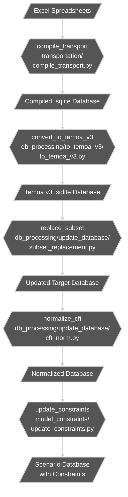

# Canadian Open Energy Model (CANOE) - Transportation Sector With Fuel Supply

Framework for the transportation energy system database of the Canadian Open Energy Model

This repository contains the compiled input data of the transportation sector used for the CANOE project.

## Repository Structure

- **this directory**  
  Contains the original schema and alternative scenarios of the CANOE-transportation database, including the _reference_ (ref) scenario.  
- **transportation/**  
  Contains the annotated transport sector databases in Excel spreadsheet format and a compiler (`compile_transport.py`) that inserts .xlsx tables into the .sqlite of the vanilla model.
- **db_processing/**  
  Contains scripts used to process the compiled database from the Excel spreadsheets into usable formats for the Temoa framework.
  - `to_temoa_v3/`  
    Converts the compiled database into the Temoa v3 format (`to_temoa_v3.py`).
  - `update_database/`  
    Contains scripts for updating and normalizing the database, such as `subset_replacement.py` (for replacing subsets of the database) and `cft_norm.py` (for normalizing capacity factor tables).
- **model_constraints/**  
  Contains Excel spreadsheets with the different explicit (user-defined) constraints applied to the vanilla CANOE-transportation model, and scripts (e.g., `update_constraints.py`) to apply them.
- **charging_profiles/**  
  Contains the input parameters used to simulate the LDV charging profiles with the RAMP-mobility framework.
- **results_analysis/**  
  Contains the Jupyter notebooks used to analyze CANOE-transportation scenario results.
- **fuel_supply/**  
  Contains fuel supply input data used in the spreadsheet databases.

---

## Quickstart

1. **Compile the database from spreadsheets**
    - Edit and run the Jupyter notebook `Create database.ipynb` **OR** run the main scripts in sequence:
    ```python
    # Compile the transport database from Excel
    from transportation.compile_transport import compile_transport
    compile_transport(province='ON', spreadsheet_name_format='CANOE_TRN_<r>_v4', db_name_format='canoe_trn_<r>_vanilla4')
    ```

2. **Convert to Temoa v3 format**
    ```python
    from db_processing.to_temoa_v3.to_temoa_v3 import convert_to_temoa_v3
    convert_to_temoa_v3(db_name='canoe_trn_on_vanilla4')
    ```

3. **Replace subset in the database**
    ```python
    from db_processing.update_database.subset_replacement import replace_subset
    replace_subset(
        target_name='canoe_on_12d_vanilla4',
        source_name='canoe_trn_on_vanilla4_v3',
        subset_name='canoe_trn_on_vanilla4_v3'
    )
    ```

4. **Normalize capacity factor tables (optional)**
    ```python
    from db_processing.update_database.cft_norm import normalize_cft
    normalize_cft('canoe_on_12d_vanilla4')
    ```

5. **Apply model constraints**
    ```python
    from model_constraints.update_constraints import update_constraints
    update_constraints(
        db_source='canoe_on_12d_vanilla4',
        db_target='canoe_on_12d_lowgrowth',
        constraints='trn_constraints_lowgrowth'
    )
    ```

---

## Flowchart: Script and Function Relationships



