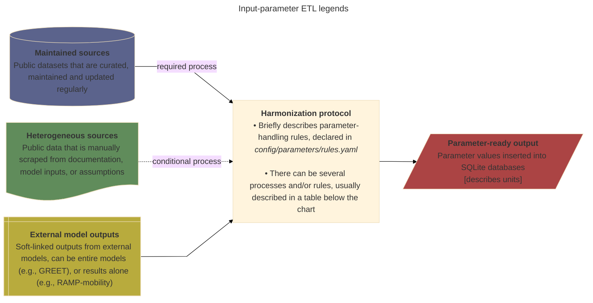
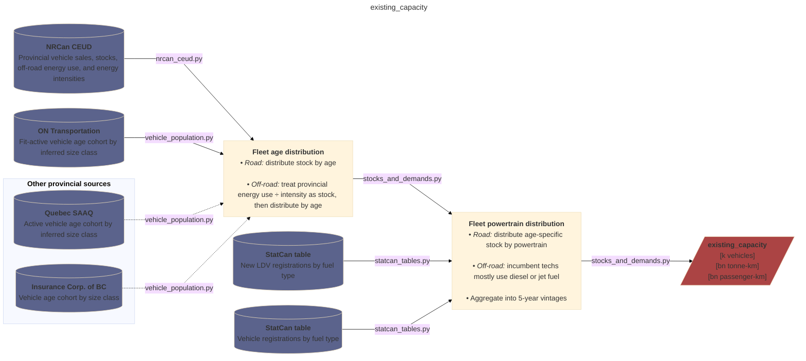
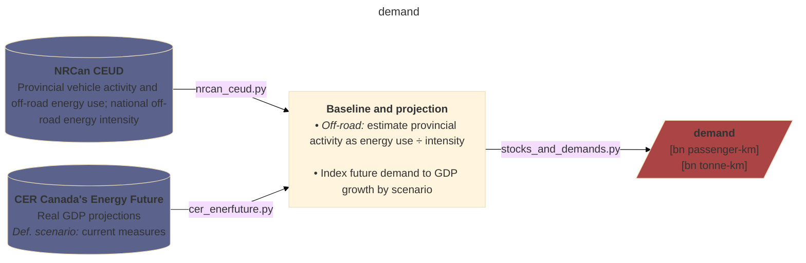
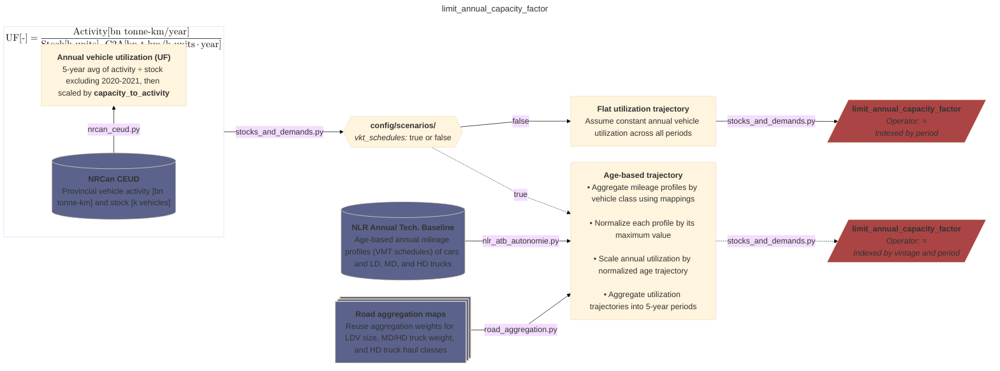
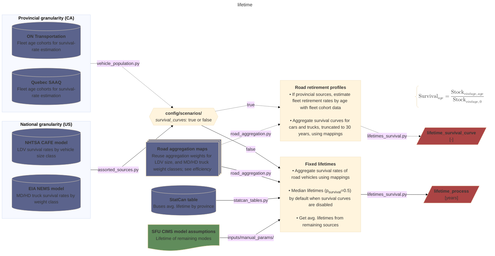
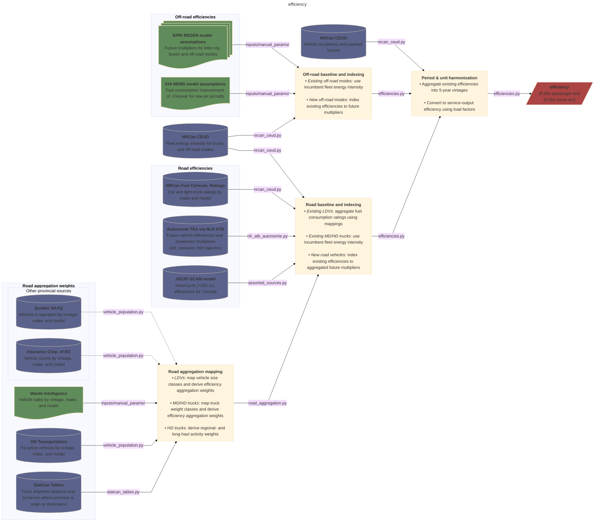
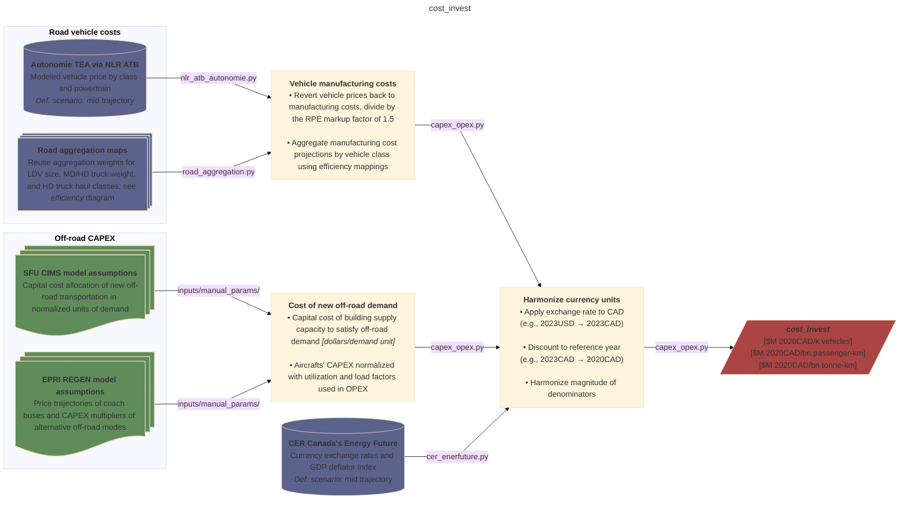
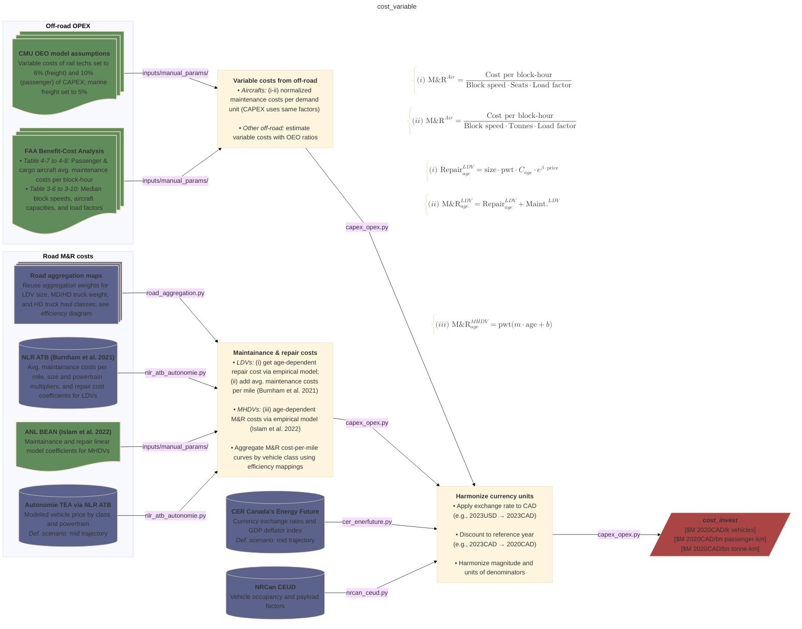

# CANOE Transportation Backend

This repository contains the v2.0 refactor scaffold for the CANOE transportation backend.

The long-term goal is a reproducible, validation-first, Snakemake-orchestrated Python workflow that builds CANOE/Temoa-ready SQLite databases for transport-sector modeling.

The current implementation is still early-stage. It includes:

* YAML-based configuration loading;
* canonical path resolution;
* source-fetch/cache adapters for selected upstream inputs;
* interim normalization for early source tables;
* runtime hygiene and repo doctor utilities;
* focused tests for config loading and initial fetcher behavior.

It does **not** compile full SQLite databases yet. Parameterization modules, end-to-end workflow rules, and baseline SQLite parity validation will be added incrementally.

## Development workflow

During early development, direct Python entrypoints are the primary way to test source adapters and parameter modules. Snakemake is currently a thin orchestration layer and should not block ordinary module-level work unless the task edits workflow files or connects multiple stages.

Use this order of checks for most implementation tasks:

1. Run the repo doctor.
2. Run Ruff and focused tests for touched files.
3. Run the relevant source or parameter module directly.
4. Use Snakemake only when validating workflow wiring.

## Current module entrypoints

Fetch/cache and normalize NRCan CEUD Ontario transport tables:

```powershell
uv run python -m fetching.nrcan_ceud --scenario config/scenarios/legacy_reproduction.yaml --regions ON --skip-national
```

Run the same NRCan step using cached inputs only:

```powershell
uv run python -m fetching.nrcan_ceud --scenario config/scenarios/legacy_reproduction.yaml --regions ON --skip-national --no-download
```

Fetch/cache and normalize Ontario vehicle population Reports 4 and 5:

```powershell
uv run python -m fetching.vehicle_population --scenario config/scenarios/legacy_reproduction.yaml --year 2022
```

These commands are module-level smoke checks. They are preferred during early source-adapter development because failures are easier to attribute to Python logic, config, source metadata, or cache state.

## Snakemake status

Snakemake is intended to orchestrate the full backend once more stages exist: source registration, fetching, normalization, parameterization, SQLite creation, validation, and reports.

At this stage, Snakemake should remain minimal and side-effect-light. It should wrap stable CLI entrypoints rather than contain complex transformation logic.

Use Snakemake checks when:

* editing `workflow/Snakefile` or files under `workflow/`;
* connecting multiple stages through declared inputs and outputs;
* preparing an end-to-end reproducible build target;
* validating that a scenario can construct a workflow DAG.

Do not treat Snakemake dry-runs as a blocker for routine module-level ETL work unless the task specifically changes workflow orchestration.

Preferred workflow smoke check, once the doctor target is available:

```powershell
uv run snakemake -n --snakefile workflow/Snakefile --config scenario=config/scenarios/legacy_reproduction.yaml --cores 1 outputs/logs/doctor.ok
```

Run the smoke target:

```powershell
uv run snakemake --snakefile workflow/Snakefile --config scenario=config/scenarios/legacy_reproduction.yaml --cores 1 outputs/logs/doctor.ok
```

A full no-target Snakemake dry-run is a Tier 2 workflow check, not a default development gate.

## Runtime hygiene

Use `scripts/clean_runtime.py` to inspect local runtime state before deleting anything:

```powershell
uv run python scripts/clean_runtime.py
```

The cleanup command is dry-run safe by default. Apply cleanup only after reviewing the selected paths:

```powershell
uv run python scripts/clean_runtime.py --apply
```

Generated backend outputs are opt-in:

```powershell
uv run python scripts/clean_runtime.py --include-generated --apply
```

Fetched upstream cache under `inputs/0_cache/` is a separate opt-in:

```powershell
uv run python scripts/clean_runtime.py --include-cache --apply
```

Registered external model outputs under `inputs/0_external_models/` are not cleaned by this script.

Use the live-download-free doctor for Tier 0 checks:

```powershell
uv run python scripts/doctor.py
```

The doctor command should load configs, resolve paths, verify imports, and report repo readiness without fetching live data or mutating repository state.

## Verification tiers

Use the lightest validation tier that matches the task. Higher tiers are important, but they should not block early module-level development unless the task depends on them.

| Tier | Scope                                                     | Typical commands                                                                                                                       | Blocks which work?               |
| ---- | --------------------------------------------------------- | -------------------------------------------------------------------------------------------------------------------------------------- | -------------------------------- |
| 0    | Imports, config loading, repo doctor, lint, focused tests | `uv run python scripts/doctor.py`; `uv run ruff check scripts src tests`; focused `uv run pytest ...`                                  | Routine code/config changes      |
| 1    | Cache-only source or parameter smoke checks               | `uv run python -m fetching.nrcan_ceud --scenario config/scenarios/legacy_reproduction.yaml --regions ON --skip-national --no-download` | Work touching that source/module |
| 2    | Snakemake DAG and workflow wiring                         | `uv run snakemake -n --snakefile workflow/Snakefile --config scenario=config/scenarios/legacy_reproduction.yaml --cores 1 <target>`    | Workflow changes only            |
| 3    | Full SQLite build and baseline parity validation          | Full workflow build plus validation reports                                                                                            | Baseline reproduction milestones |

Recommended focused test command for the current scaffold:

```powershell
uv run pytest tests/test_config.py tests/test_nrcan_ceud.py tests/test_vehicle_population.py tests/test_runtime_hygiene.py
```

If a stale or locked pytest runtime directory blocks default pytest startup on Windows, inspect runtime state first:

```powershell
uv run python scripts/clean_runtime.py
```

For one-off verification while a lock is being investigated, use fresh repo-local pytest runtime paths:

```powershell
uv run pytest tests/test_config.py tests/test_nrcan_ceud.py tests/test_vehicle_population.py tests/test_runtime_hygiene.py --basetemp=.pytest-basetemp-manual -o cache_dir=.pytest-cache-runtime-manual
```

Full `uv run pytest`, full Snakemake dry-runs, SQLite builds, and parity reports remain important, but they are not required for every early ETL iteration.


## Input-parameter ETL flowcharts

### Mermaid version

```mermaid
info
```

### Flowchart legends


```mermaid
---
title: Input-parameter ETL legends
config:
  layout: dagre
  theme: base
  themeVariables:
    fontSize: 17px
  flowchart:
    nodeSpacing: 35
    rankSpacing: 50
    wrappingWidth: 250
    curve: linear
---
flowchart LR
  %% --- Sources ---
  s0[("`**Maintained sources**<br>Public datasets that are curated, maintained and updated regularly`")]
  s1@{shape: doc, label: "**Heterogeneous sources**<br>Public data that is manually scraped from documentation, model inputs, or assumptions"}
  s2@{shape: win-pane, label: "**External model outputs**<br>Soft-linked outputs from external models, can be entire models (e.g., GREET), or results alone (e.g., RAMP-mobility)" }

  %% --- Processes ---
  p1["`**Harmonization protocol**<br>• Briefly describes parameter-handling rules, declared in *config/parameters/rules.yaml*<br><br>• There can be several processes and/or rules, usually described in a table below the chart`"]

  s0 -- required process --> p1
  s1 -. conditional process .-> p1
  s2 --> p1 

  p1 --> o1[/"`**Parameter-ready output**<br>Parameter values inserted into SQLite databases<br>[describes units]`"/]

  %% --- Styling ---
  classDef database fill:#5b638c
  classDef doc fill:#608c5b
  classDef model fill:#b8ab3d
  classDef output fill:#ab4444

  class s0 database
  class s1 doc
  class s2 model
  class o1 output
```

### `existing_capacity`


```mermaid
---
title: existing_capacity
config:
  layout: dagre
  theme: base
  themeVariables:
    fontSize: 17px
  flowchart:
    nodeSpacing: 35
    rankSpacing: 50
    wrappingWidth: 250
    curve: linear
---
flowchart LR
  %% --- Sources ---
  s0[("`**NRCan CEUD**<br>Provincial vehicle sales, stocks, off-road energy use, and energy intensities`")]
  s1[("`**ON Transportation**<br>Fit-active vehicle age cohort by inferred size class`")]

  subgraph expansion["`**Other provincial sources**`"]
    s2[("`**Quebec SAAQ**<br>Active vehicle age cohort by inferred size class`")]
    s3[("`**Insurance Corp. of BC**<br>Vehicle age cohort by size class`")]
  end

  s4[("`**StatCan table**<br>New LDV registrations by fuel type`")]
  s5[("`**StatCan table**<br>Vehicle registrations by fuel type`")]

  %% --- Processes ---
  p1["`**Fleet age distribution<br>**• *Road:* distribute stock by age<br><br>• *Off-road:* treat provincial energy use ÷ intensity as stock, then distribute by age`"]
  s0 -- nrcan_ceud.py --> p1
  s1 -- vehicle_population.py --> p1
  s2 -. "vehicle_population.py" .-> p1
  s3 -. "vehicle_population.py" .-> p1

  p2["`**Fleet powertrain distribution**<br>• *Road:* distribute age-specific stock by powertrain<br><br>• *Off-road:* incumbent techs mostly use diesel or jet fuel<br><br>• Aggregate into 5-year vintages`"]
  p1 -- stocks_and_demands.py --> p2
  s4 -- statcan_tables.py --> p2
  s5 -- statcan_tables.py --> p2

  p2 -- stocks_and_demands.py --> o1[/"`**existing_capacity**<br>[k vehicles]<br>[bn tonne-km]<br>[bn passenger-km]`"/]

  %% --- Styling ---
  classDef database fill:#5b638c
  classDef doc fill:#608c5b
  classDef output fill:#ab4444

  class s0,s1,s2,s3,s4,s5 database;
  class o1 output;

  %% --- Hyperlinks ---
  click s5 "https://doi.org/10.25318/2310030801-eng"
  click s4 "https://doi.org/10.25318/2010002501-eng"
  click s3 "https://public.tableau.com/app/profile/icbc/viz/VehiclePopulationIntroPage/VehiclePopulationData"
  click s2 "https://www.donneesquebec.ca/recherche/dataset/vehicules-en-circulation"
  click s1 "https://data.ontario.ca/dataset/vehicle-population-data"
  click s0 "https://oee.nrcan.gc.ca/corporate/statistics/neud/dpa/menus/trends/comprehensive_tables/list.cfm"
```

| Harmonization rule                                     | Affected classes      | Description                                                                                                                          |
| ------------------------------------------------------ | --------------------- | ------------------------------------------------------------------------------------------------------------------------------------ |
| Fetch vehicle counts by inferred size class            | Cars and light trucks | Size classes are inferred from vehicle model and make                                                                                |
| Distribute stock by age                                | Road vehicles         | Distribute NRCan CEUD stocks over existing vintages using age cohort registrations                                                   |
| Treat energy use<sub>province</sub>÷intensity as stock | Off-road modes        | Air, rail and marine fleet size are estimated from the available supply capacity to satisfy demand by vintage (in demand units)      |
| Distribute stock by age                                | Off-road modes        | Available demand supply by vintage is estimated with a fleet turnover approximation assuming an avg. annual retirement of 1÷lifetime |
| Distribute stock<sub>age</sub> by powertrain           | Cars and light trucks | Each stock by vintage gets distributed over vehicle market shares by fuel type                                                       |
| Distribute stock<sub>age</sub> by powertrain           | MD trucks             | Each stock by vintage gets distributed over vehicle registration shares by fuel type – mainly diesel and gasoline                    |
### `demand`


```mermaid
---
title: demand
config:
  layout: dagre
  theme: base
  themeVariables:
    fontSize: 17px
  flowchart:
    nodeSpacing: 35
    rankSpacing: 50
    wrappingWidth: 250
    curve: linear
---
flowchart LR
  %% --- Sources ---
  s0[("`**NRCan CEUD**<br>Provincial vehicle activity and off-road energy use; national off-road energy intensity`")]
  s1[("`**CER Canada's Energy Future**<br>Real GDP projections<br>*Def. scenario:* current measures`")]

  %% --- Processes ---
  p1["`**Baseline and projection**<br>• *Off-road:* estimate provincial activity as energy use ÷ intensity<br><br>• Index future demand to GDP growth by scenario`"]

  s0 -- nrcan_ceud.py --> p1
  s1 -- cer_enerfuture.py --> p1

  p1 -- stocks_and_demands.py --> o1[/"`**demand**<br>[bn passenger-km]<br>[bn tonne-km]`"/]

  %% --- Styling ---
  classDef database fill:#5b638c
  classDef doc fill:#608c5b
  classDef output fill:#ab4444

  class s0,s1 database;
  class o1 output;

  %% --- Hyperlinks ---
  click s0 "https://oee.nrcan.gc.ca/corporate/statistics/neud/dpa/menus/trends/comprehensive_tables/list.cfm"
  click s1 "https://open.canada.ca/data/en/dataset/07c42deb-9435-43b9-a416-7ce316f3893d"
```

| Harmonization rule                                                      | Affected classes | Description                                                                                                    |
| ----------------------------------------------------------------------- | ---------------- | -------------------------------------------------------------------------------------------------------------- |
| Estimate provincial activity as energy use<sub>province</sub>÷intensity | Off-road modes   | Provincial energy consumption [PJ] divided by national energy intensity [PJ/bn-tkm] as provincial demand proxy |
| Index future demand to GDP growth                                       | All              | Base year demand is indexed to future GDP growth projections by scenario                                       |
### `limit_annual_capacity_factor`


```mermaid
---
title: limit_annual_capacity_factor
config:
  layout: dagre
  theme: base
  themeVariables:
    fontSize: 17px
  flowchart:
    nodeSpacing: 35
    rankSpacing: 50
    wrappingWidth: 250
    curve: linear
---
flowchart LR
  %% --- Sources ---
  s0[("`**NRCan CEUD**<br>Provincial vehicle activity [bn tonne-km] and stock [k vehicles]`")]
  s1[("`**NLR Annual Tech. Baseline**<br>Age-based annual mileage profiles (VMT schedules) of cars and LD, MD, and HD trucks`")]
  s2@{shape: processes, label: "**Road aggregation maps**<br>Reuse aggregation weights for LDV size, MD/HD truck weight, and HD truck haul classes"}
  
  %% --- Processes ---
  subgraph utilization["$$\\mathrm{UF[\text{-}]}=\\frac{\\mathrm{Activity[bn\\;tonne\text{-}km/year]}}{\\mathrm{Stock[k\\;units]}\\cdot \\mathrm{C2A[bn\\;t\text{-}km/k\\;units\\cdot year]}}$$"]
	  direction BT
	  p0["`**Annual vehicle utilization (UF)**<br>5-year avg of activity ÷ stock excluding 2020-2021, then scaled by **capacity_to_activity**`"]
	  s0 -- nrcan_ceud.py --> p0
  end
  style utilization fill:transparent,color:transparent
    
  p1@{shape: hex, label: "**config/scenarios/**<br>*vkt_schedules:* true or false"}
  utilization -- stocks_and_demands.py --> p1
    
  p2["`**Flat utilization trajectory**<br>Assume constant annual vehicle utilization across all periods`"]
  p1 -- false --> p2
  
  o1[/"`**limit_annual_capacity_factor**<br>*Operator: =*<br>*Indexed by period*`"/]
  p2 -- stocks_and_demands.py --> o1
  
  p3["`**Age-based trajectory**<br>• Aggregate mileage profiles by vehicle class using mappings<br><br>• Normalize each profile by its maximum value<br><br>• Scale annual utilization by normalized age trajectory<br><br>• Aggregate utilization trajectories into 5-year periods`"]
  p1 -. true .-> p3
  s1 -- nlr_atb_autonomie.py --> p3
  s2 -- road_aggregation.py --> p3
  
  o2[/"`**limit_annual_capacity_factor**<br>*Operator: =*<br>*Indexed by vintage and period*`"/]
  p3 -. "stocks_and_demands.py" .-> o2
  
  %% --- Styling ---
  classDef database fill:#5b638c
  classDef doc fill:#608c5b
  classDef output fill:#ab4444

  class s0,s1,s2,s3 database;
  class o1,o2 output;

  %% --- Hyperlinks ---
  click s0 "https://oee.nrcan.gc.ca/corporate/statistics/neud/dpa/menus/trends/comprehensive_tables/list.cfm"
  click s1 "https://atb.nlr.gov/transportation/2024/data"
```

| Harmonization rule                          | Affected classes | Description                                                                                                                                                           |
| ------------------------------------------- | ---------------- | --------------------------------------------------------------------------------------------------------------------------------------------------------------------- |
| Annual utilization as activity÷stock ratios | Road vehicles    | Represents how much activity a unit of capacity can deliver annually. Utilization is scaled with an arbitrary `capacity_to_activity` factor to avoid near-zero values |
| Assume constant annual utilization          | Road vehicles    | Annual utilization derived from 5-year average ratios remains constant across all periods                                                                             |
| Aggregate profiles and normalize            | Road vehicles    | Aggregate annual mileage profiles by vehicle size/weight class using aggregation mappings (see `efficiency` flowchart) and apply max scaling to each series           |
| Scale utilization by normalized trajectory  | Road vehicles    | Baseline utilization is indexed through normalized age trajectories to obtain utilization as a function of vehicle age, mostly decaying                               |

### `lifetime_process` and `lifetime_survival_curve`


```mermaid
---
title: lifetime
config:
  layout: dagre
  theme: base
  themeVariables:
    fontSize: 17px
  flowchart:
    nodeSpacing: 35
    rankSpacing: 50
    wrappingWidth: 250
    curve: linear
---
flowchart LR
  %% --- Sources ---
  subgraph national["`**National granularity (US)**`"]
    direction LR
    s2[("`**NHTSA CAFE model**<br>LDV survival rates by vehicle size class`")]
    s3[("`**EIA NEMS model**<br>MD/HD truck survival rates by weight class`")]
  end
  subgraph provincial["`**Provincial granularity (CA)**`"]
    direction LR
    s0[("`**ON Transportation**<br>Fleet age cohorts for survival-rate estimation`")]
    s1[("`**Quebec SAAQ**<br>Fleet age cohorts for survival-rate estimation`")]
  end

  %% --- Processes ---
  p1@{shape: hex, label: "**config/scenarios/**<br>*survival_curves:* true or false"}
  provincial -. "vehicle_population.py" .-> p1
  national -- assorted_sources.py --> p1
  
  s6@{shape: processes, label: "**Road aggregation maps**<br>Reuse aggregation weights for LDV size, and MD/HD truck weight classes; see *efficiency*"}
  s4[("`**StatCan table**<br>Buses avg. lifetime by province`")]
  s5@{shape: doc, label: "**SFU CIMS model assumptions**<br>Lifetime of remaining modes"}

  p2_2@{shape: comment, label: "$$\\mathrm{Survival}_{age}=\\frac{\\mathrm{Stock}_{vintage,age}}{\\mathrm{Stock}_{vintage,0}}$$"}
  p2["`**Road retirement profiles**<br>• If provincial sources, estimate fleet retirement rates by age with fleet cohort data<br><br>• Aggregate survival curves for cars and trucks, truncated to 30 years, using mappings`"]
  p1 -. true .-> p2
  s6 -. "road_aggregation.py" .-> p2
  p2 ~~~ p2_2
  
  p3["`**Fixed lifetimes**<br>• Aggregate survival rates of road vehicles using mappings<br><br>• Median lifetimes (p<sub>survival</sub>=0.5) by default when survival curves are disabled<br><br>• Get avg. lifetimes from remaining sources`"]
  p1 -- false --> p3
  s6 -- road_aggregation.py --> p3
  s4 -- statcan_tables.py --> p3
  s5 -- inputs/manual_params/ --> p3

  p2 -. "lifetimes_survival.py" .-> o1[/"`**lifetime_survival_curve**<br>[-]`"/]
  p3 -- lifetimes_survival.py --> o2[/"`**lifetime_process**<br>[years]`"/]

  %% --- Styling ---
  classDef database fill:#5b638c
  classDef doc fill:#608c5b
  classDef output fill:#ab4444

  class s0,s1,s2,s3,s4,s6 database;
  class s5 doc;
  class o1,o2 output;

  %% --- Hyperlinks ---
  click s0 "https://data.ontario.ca/dataset/vehicle-population-data"
  click s1 "https://www.donneesquebec.ca/recherche/dataset/vehicules-en-circulation"
  click s2 "https://www.nhtsa.gov/file-downloads?p=nhtsa/downloads/CAFE/2024-FRM-LD-2b3-2027-2035/Central-Analysis/"
  click s3 "https://github.com/EIAgov/NEMS/blob/main/input/tdm/trnhdvx.xlsx"
  click s4 "https://doi.org/10.25318/3410025401-eng"
  click s5 "https://github.com/EMRG-SFU/cims-models/tree/main/sources/sectors"
```

| Harmonization rule                        | Affected classes | Description                                                                                                                                              |
| ----------------------------------------- | ---------------- | -------------------------------------------------------------------------------------------------------------------------------------------------------- |
| Survival curves are truncated to 30 years | Cars and trucks  | TBD #to-do                                                                                                                                               |
| Median lifetimes compiled by default      | All              | By default, survival curves are omitted and the median value of the distribution is used as vehicle lifetime, all remaining classes use an avg. lifetime |
**Notes:**
- NHTSA CAFE model, used for cars and light trucks - survival rates table is inside parameters_ref.xlsx in 'Vehicle Age Data'!A3:E45, such file is downloaded at: <https://static.nhtsa.gov/nhtsa/downloads/CAFE/2024-FRM-LD-2b3-2027-2035/Central-Analysis/Central_Analysis_Inputs.zip>
- EIA NEMS model, used for medium and heavy trucks - survival rate table is inside trnhdv.xlsx in trnhdv!A86:D120, such file is downloaded from the NEMS repo: <https://github.com/EIAgov/NEMS/blob/main/input/tdm/trnhdvx.xlsx>
- Motorcycles, aircrafts, rails, and marine vessels, and other infrastructure's avg/median lifetime would be manual input directly at `inputs/manual_params/`. Road technologies with survival curves would also have their median lifetimes listed there. If survival curves are derived in scenario configuration, these would supersede the default technology parameter from the csv integer entry for that given technology

### `efficiency`

*Note: Some technologies are not represented in this diagram, see config/parameters/harmonization_rules.yaml for full disclosure.*

```mermaid
---
title: efficiency
config:
  layout: dagre
  theme: base
  themeVariables:
    fontSize: 17px
  flowchart:
    nodeSpacing: 35
    rankSpacing: 50
    wrappingWidth: 250
    curve: linear
---
flowchart LR
  %% --- Sources ---
  subgraph road["`**Road efficiencies**`"]
	  s1[("`**NRCan Fuel Consum. Ratings**<br>Car and light-truck ratings by make and model`")]
	  s2[("`**Autonomie TEA via NLR ATB**<br>Future vehicle efficiencies and powertrain multipliers<br>*Def. scenario:* mid trajectory`")]
	  s2_2[("`**JGCRI GCAM model**<br>Motorcycle (>250 cc) efficiencies for Canada`")]
  end
  subgraph agg["`**Road aggregation weights**`"]
	  s3@{shape: doc, label: "**Wards Intelligence**<br>Vehicle sales by vintage, make, and model"}
	  s4[("`**ON Transportation**<br>Fit-active vehicles by vintage, make, and model`")]
	  s10[("`**StatCan Tables**<br>Truck shipment distance and tonne-km where province is origin or destination`")]
	  subgraph expansion["`Other provincial sources`"]
	    s5[("`**Quebec SAAQ**<br>Vehicles in operation by vintage, make, and model`")]
	    s6[("`**Insurance Corp. of BC**<br>Vehicle counts by vintage, make, and model`")]
	  end
  end
  s0[("`**NRCan CEUD**<br>Fleet energy intensity for trucks and off-road modes`")]
  s9[("`**NRCan CEUD**<br>Vehicle occupancy and payload factors`")]
	  
  %% --- Processes ---
  p0["`**Road aggregation mapping**<br>• *LDVs:* map vehicle size classes and derive efficiency aggregation weights<br><br>• *MD/HD trucks:* map truck weight classes and derive efficiency aggregation weights<br><br>• *HD trucks:* derive regional- and long-haul activity weights`"]
  s3 -- inputs/manual_params/ --> p0
  s4 -- vehicle_population.py --> p0
  s5 & s6 -. "vehicle_population.py" .-> p0
  s10 -- statcan_tables.py --> p0
	  
  p2["`**Road baseline and indexing**<br>• *Existing LDVs:* aggregate fuel consumption ratings using mappings<br><br>• *Existing MD/HD trucks:* use incumbent fleet energy intensity<br><br>• *New road vehicles:* index existing efficiencies to aggregated future multipliers`"]
  s1 -- nrcan_ceud.py --> p2
  s2 -- nlr_atb_autonomie.py --> p2
  s2_2 -- assorted_sources.py --> p2
  p0 -- road_aggregation.py --> p2
  
  %% --- Sources ---
  subgraph off["`**Off-road efficiencies**`"]
	  s7@{shape: docs, label: "**EPRI REGEN model assumptions**<br>Future multipliers for inter-city buses and off-road modes"}
	  s8@{shape: doc, label: "**EIA NEMS model assumptions**<br>Fuel consumption improvement of -1%/year for new jet aircrafts"}
  end
	  
  %% --- Processes ---
  p3["`**Off-road baseline and indexing**<br>• *Existing off-road modes:* use incumbent fleet energy intensity<br><br>• *New off-road modes:* index existing efficiencies to future multipliers`"]
  s7 -- inputs/manual_params/ --> p3
  s8 -- inputs/manual_params/ --> p3
  
  s0 -- nrcan_ceud.py --> p2
  s0 -- nrcan_ceud.py --> p3
  
  %% --- Processes ---
  p4["`**Period & unit harmonization**<br>• Aggregate existing efficiencies into 5-year vintages<br><br>• Convert to service-output efficiency using load factors`"]
  s9 -- nrcan_ceud.py --> p4
  p2 -- efficiencies.py --> p4
  p3 -- efficiencies.py --> p4

  p4 -- efficiencies.py --> o1[/"`***efficiency***<br>[PJ/bn passenger-km]<br>[PJ/bn tonne-km]`"/]

  %% --- Styling ---
  classDef database fill:#5b638c
  classDef doc fill:#608c5b
  classDef output fill:#ab4444

  class s0,s1,s2,s4,s5,s6,s9,s10,s2_2 database;
  class s3,s7,s8 doc;
  class o1 output;

  %% --- Hyperlinks ---
  click s6 "https://public.tableau.com/app/profile/icbc/viz/VehiclePopulationIntroPage/VehiclePopulationData"
  click s5 "https://www.donneesquebec.ca/recherche/dataset/vehicules-en-circulation"
  click s4 "https://data.ontario.ca/dataset/vehicle-population-data"
  click s9 "https://oee.nrcan.gc.ca/corporate/statistics/neud/dpa/menus/trends/comprehensive_tables/list.cfm"
  click s0 "https://oee.nrcan.gc.ca/corporate/statistics/neud/dpa/menus/trends/comprehensive_tables/list.cfm"
  click s7 "https://us-regen-docs.epri.com/v2025/assumptions/transportation.html#non-road-vehicles"
  click s8 "https://www.eia.gov/outlooks/aeo/assumptions/pdf/TDM_Assumptions.pdf"
  click s2 "https://atb.nlr.gov/transportation/2024/data"
  click s1 "https://open.canada.ca/data/en/dataset/98f1a129-f628-4ce4-b24d-6f16bf24dd64"
  click s10 "https://doi.org/10.25318/2310014201-eng"
  click s2_2 "https://github.com/JGCRI/gcam-core/tree/master/input/gcamdata/inst/extdata/energy"
```

| Harmonization rule                                | Affected classes           | Description                                                                                                                                                                                                      |
| ------------------------------------------------- | -------------------------- | ---------------------------------------------------------------------------------------------------------------------------------------------------------------------------------------------------------------- |
| Map size classes and derive aggregation weights   | Cars and light trucks      | Map vehicle make/model counts to size classes that align with NRCan efficiency ratings and Autonomie projections                                                                                                 |
| Map weight classes and derive aggregation weights | MD/HD trucks               | Map truck weight-rating counts to classes that align with Autonomie truck projection classes                                                                                                                     |
| Derive regional- and long-haul activity weights   | Heavy-duty trucks          | Group HD truck tonne-km into regional- and long-haul activity buckets to aggregate Autonomie haul classes                                                                                                        |
| Aggregate efficiency ratings using mappings       | Cars and light trucks      | Use size-class aggregation weights to convert model-level fuel consumption ratings into fleet-average efficiencies by powertrain                                                                                 |
| Use incumbent fleet energy intensity              | MD/HD trucks and off-road  | Use NRCan incumbent fleet energy intensities as proxies for existing technology efficiencies where fuel use is dominated by one fuel type                                                                        |
| Index existing efficiencies to future multipliers | All                        | Apply alternative-powertrain and future-period multipliers to existing efficiencies (e.g., 2030 battery-electric and 2040 fuel-cell multipliers)                                                                 |
| Special handling of buses                         | Transit, school, intercity | Use reported Autonomie values for existing and future transit and school bus efficiencies; use EPRI REGEN inputs for intercity buses                                                                             |
| Special handling of motorcycles                   | Motorcycles                | Use [PNNL GCAM](https://github.com/JGCRI/gcam-core/tree/master/input/gcamdata/inst/extdata/energy) Canada transportation inputs from `UCD_trn_data_CORE.csv` for future motorcycle (engine >250 cc) efficiencies |
| Convert to service-output efficiency units        | All                        | Convert source efficiencies (e.g., L/100 km or mpg) into demand units (e.g., bn tonne-km/PJ) with NRCan CEUD load factors; using HHVs.                                                                           |
### `cost_invest`

*Note: Some technologies are not represented in this diagram, see config/parameters/harmonization_rules.yaml for full disclosure.*

```mermaid
---
title: cost_invest
config:
  layout: dagre
  theme: base
  themeVariables:
    fontSize: 17px
  flowchart:
    nodeSpacing: 35
    rankSpacing: 50
    wrappingWidth: 250
    curve: linear
---
flowchart LR
  s3[("`**CER Canada's Energy Future**<br>Currency exchange rates and GDP deflator index<br>*Def. scenario:* mid trajectory`")]
  subgraph offroad["`**Off-road CAPEX**`"]
	  %% --- Sources ---
	  s7@{shape: docs, label: "**SFU CIMS model assumptions**<br>Capital cost allocation of new off-road transportation in normalized units of demand"}
	  s8@{shape: docs, label: "**EPRI REGEN model assumptions**<br>Price trajectories of coach buses and CAPEX multipliers of alternative off-road modes"}
  end
	  
  %% --- Processes ---
  p3["`**Cost of new off-road demand**<br>• Capital cost of building supply capacity to satisfy off-road demand *[dollars/demand unit]*<br><br>• Aircrafts' CAPEX normalized with utilization and load factors used in OPEX`"]
  s7 & s8 -- inputs/manual_params/ --> p3
  
  subgraph road["`**Road vehicle costs**`"]
	  %% --- Sources ---
	  s1@{shape: processes, label: "**Road aggregation maps**<br>Reuse aggregation weights for LDV size, MD/HD truck weight, and HD truck haul classes; see *efficiency* diagram"}
	  s2[("`**Autonomie TEA via NLR ATB**<br>Modeled vehicle price by class and powertrain<br>*Def. scenario:* mid trajectory`")]
  end
	  
  %% --- Processes ---
  p2["`**Vehicle manufacturing costs**<br>• Revert vehicle prices back to manufacturing costs, divide by the RPE markup factor of 1.5<br><br>• Aggregate manufacturing cost projections by vehicle class using efficiency mappings`"]
  s2 -- nlr_atb_autonomie.py --> p2
  s1 -- road_aggregation.py --> p2
  
  p4["`**Harmonize currency units**<br>• Apply exchange rate to CAD<br>(e.g., 2023USD → 2023CAD)<br><br>• Discount to reference year<br>(e.g., 2023CAD → 2020CAD)<br><br>• Harmonize magnitude of denominators`"]
  p2 -- capex_opex.py --> p4
  p3 -- capex_opex.py --> p4
  s3 -- cer_enerfuture.py --> p4

  p4 -- capex_opex.py --> o1[/"`***cost_invest***<br>[$M 2020CAD/k vehicles]<br>[$M 2020CAD/bn passenger-km]<br>[$M 2020CAD/bn tonne-km]`"/]

  %% --- Styling ---
  classDef database fill:#5b638c
  classDef doc fill:#608c5b
  classDef output fill:#ab4444

  class s1,s2,s3 database;
  class s7,s8 doc;
  class o1 output;

  %% --- Hyperlinks ---
  click s8 "https://us-regen-docs.epri.com/v2025/assumptions/transportation.html#non-road-vehicles"
  click s7 "https://github.com/EMRG-SFU/cims-models/tree/main/sources/sectors"
  click s2 "https://vms.taps.anl.gov/research-highlights/vehicle-technologies/u-s-doe-vto-hfto-r-d-benefits/"
  click s3 "https://open.canada.ca/data/en/dataset/07c42deb-9435-43b9-a416-7ce316f3893d"
```

| Harmonization rule                                | Affected classes           | Description                                                                                                                                                                                                      |
| ------------------------------------------------- | -------------------------- | ---------------------------------------------------------------------------------------------------------------------------------------------------------------------------------------------------------------- |
| Map size classes and derive aggregation weights   | Cars and light trucks      | Map vehicle make/model counts to size classes that align with NRCan efficiency ratings and Autonomie projections                                                                                                 |
| Map weight classes and derive aggregation weights | MD/HD trucks               | Map truck weight-rating counts to classes that align with Autonomie truck projection classes                                                                                                                     |
| Derive regional- and long-haul activity weights   | Heavy-duty trucks          | Group HD truck tonne-km into regional- and long-haul activity buckets to aggregate Autonomie haul classes                                                                                                        |
| Aggregate efficiency ratings using mappings       | Cars and light trucks      | Use size-class aggregation weights to convert model-level fuel consumption ratings into fleet-average efficiencies by powertrain                                                                                 |
| Use incumbent fleet energy intensity              | MD/HD trucks and off-road  | Use NRCan incumbent fleet energy intensities as proxies for existing technology efficiencies where fuel use is dominated by one fuel type                                                                        |
| Index existing efficiencies to future multipliers | All                        | Apply alternative-powertrain and future-period multipliers to existing efficiencies (e.g., 2030 battery-electric and 2040 fuel-cell multipliers)                                                                 |
| Special handling of buses                         | Transit, school, intercity | Use reported Autonomie values for existing and future transit and school bus efficiencies; use EPRI REGEN inputs for intercity buses                                                                             |
| Special handling of motorcycles                   | Motorcycles                | Use [PNNL GCAM](https://github.com/JGCRI/gcam-core/tree/master/input/gcamdata/inst/extdata/energy) Canada transportation inputs from `UCD_trn_data_CORE.csv` for future motorcycle (engine >250 cc) efficiencies |
| Convert to service-output efficiency units        | All                        | Convert source efficiencies (e.g., L/100 km or mpg) into demand units (e.g., bn tonne-km/PJ) with NRCan CEUD load factors                                                                                        |

### `cost_variable`

*Note: Some technologies are not represented in this diagram, see config/parameters/harmonization_rules.yaml for full disclosure.*

```mermaid
---
title: cost_variable
config:
  layout: dagre
  theme: base
  themeVariables:
    fontSize: 17px
  flowchart:
    nodeSpacing: 35
    rankSpacing: 50
    wrappingWidth: 250
    curve: linear
---
flowchart LR
  subgraph offroad["`**Off-road OPEX**`"]
	  %% --- Sources ---
	  s7@{shape: docs, label: "**CMU OEO model assumptions**<br>Variable costs of rail techs set to 6% (freight) and 10% (passenger) of CAPEX; marine freight set to 5%"}
	  s8@{shape: docs, label: "**FAA Benefit-Cost Analysis**<br>• *Table 4-7 to 4-8:* Passenger & cargo aircraft avg. maintenance costs per block-hour<br>• *Table 3-6 to 3-10:* Median block speeds, aircraft capacities, and load factors"}
  end
	  
  %% --- Processes ---
  p3_1@{shape: comment, label: "$$(i)\\; \\mathrm{M\\&R}^{Air}=\\frac{\\mathrm{Cost\\;per\\;block\\text{-}hour}}{\\mathrm{Block\\;speed}\\cdot \\mathrm{Seats}\\cdot \\mathrm{Load\\;factor}}$$"}
  p3_2@{shape: comment, label: "$$(ii)\\; \\mathrm{M\\&R}^{Air}=\\frac{\\mathrm{Cost\\;per\\;block\\text{-}hour}}{\\mathrm{Block\\;speed}\\cdot \\mathrm{Tonnes}\\cdot \\mathrm{Load\\;factor}}$$"}
  p3["`**Variable costs from off-road**<br>• *Aircrafts:* (i-ii) normalized maintenance costs per demand unit (CAPEX uses same factors) <br><br>• *Other off-road:* estimate variable costs with OEO ratios`"]
  s7 & s8 -- inputs/manual_params/ --> p3
  p3 ~~~ p3_1
  p3 ~~~ p3_2
  
  subgraph road["`**Road M&R costs**`"]
	  %% --- Sources ---
	  s1@{shape: processes, label: "**Road aggregation maps**<br>Reuse aggregation weights for LDV size, MD/HD truck weight, and HD truck haul classes; see *efficiency* diagram"}
	  s2[("`**NLR ATB (Burnham et al. 2021)**<br>Avg. maintainance costs per mile, size and powertrain multipliers, and repair cost coefficients for LDVs`")]
	  s3@{shape: doc, label: "**ANL BEAN (Islam et al. 2022)**<br>Maintainance and repair linear model coefficients for MHDVs"}
	  s4[("`**Autonomie TEA via NLR ATB**<br>Modeled vehicle price by class and powertrain<br>*Def. scenario:* mid trajectory`")]
  end
	  
  %% --- Processes ---
  p1@{shape: comment, label: "$$(i)\\; \\mathrm{Repair}^{LDV}_{age}=\\mathrm{size}\\cdot \\mathrm{pwt}\\cdot C_{age}\\cdot e^{\\beta\\cdot \\mathrm{price}}$$"}
  p1_2@{shape: comment, label: "$$(ii)\\; \\mathrm{M\\&R}^{LDV}_{age}=\\mathrm{Repair}^{LDV}_{age}+\\mathrm{Maint.}^{LDV}$$"}
  p1_3@{shape: comment, label: "$$(iii)\\; \\mathrm{M\\&R}^{MHDV}_{age}=\\mathrm{pwt}(m\\cdot \\mathrm{age}+b)$$"}
  p2["`**Maintainance & repair costs**<br>• *LDVs:* (i) get age-dependent repair cost via empirical model;<br>(ii) add avg. maintenance costs per mile (Burnham et al. 2021)<br><br>• *MHDVs:* (iii) age-dependent M&R costs via empirical model (Islam et al. 2022)<br><br>• Aggregate M&R cost-per-mile curves by vehicle class using efficiency mappings`"]
  s2 -- nlr_atb_autonomie.py --> p2
  s4 -- nlr_atb_autonomie.py --> p2
  s3 -- inputs/manual_params/ --> p2
  s1 -- road_aggregation.py --> p2
  p2 ~~~ p1
  p2 ~~~ p1_2
  p2 ~~~ p1_3
  
  s0[("`**CER Canada's Energy Future**<br>Currency exchange rates and GDP deflator index<br>*Def. scenario:* mid trajectory`")]
  s9[("`**NRCan CEUD**<br>Vehicle occupancy and payload factors`")]
  p4["`**Harmonize currency units**<br>• Apply exchange rate to CAD<br>(e.g., 2023USD → 2023CAD)<br><br>• Discount to reference year<br>(e.g., 2023CAD → 2020CAD)<br><br>• Harmonize magnitude and units of denominators`"]
  p2 -- capex_opex.py --> p4
  p3 -- capex_opex.py --> p4
  s0 -- cer_enerfuture.py --> p4
  s9 -- nrcan_ceud.py --> p4

  p4 -- capex_opex.py --> o1[/"`***cost_invest***<br>[$M 2020CAD/k vehicles]<br>[$M 2020CAD/bn passenger-km]<br>[$M 2020CAD/bn tonne-km]`"/]

  %% --- Styling ---
  classDef database fill:#5b638c
  classDef doc fill:#608c5b
  classDef output fill:#ab4444

  class s0,s1,s2,s4,s9 database;
  class s7,s8,s3 doc;
  class o1 output;

  %% --- Hyperlinks ---
  click s9 "https://oee.nrcan.gc.ca/corporate/statistics/neud/dpa/menus/trends/comprehensive_tables/list.cfm"
  click s8 "https://www.faa.gov/regulations_policies/policy_guidance/benefit_cost"
  click s7 "https://github.com/TemoaProject/oeo/blob/master/database_documentation/TransportationSector.ipynb"
  click s2 "https://atb.nlr.gov/transportation/2024/data"
  click s2_2 "https://anl.app.box.com/s/an4nx0v2xpudxtpsnkhd5peimzu4j1hk/folder/242640145714"
  click s0 "https://open.canada.ca/data/en/dataset/07c42deb-9435-43b9-a416-7ce316f3893d"
  click s3 "https://vms.taps.anl.gov/research-highlights/vehicle-technologies/u-s-doe-vto-hfto-r-d-benefits/"
  click s4 "https://vms.taps.anl.gov/research-highlights/vehicle-technologies/u-s-doe-vto-hfto-r-d-benefits/"
```

| Harmonization rule                            | Affected classes                                                 | Description                                                                                                                                                                                                                                                                                                                         |
| --------------------------------------------- | ---------------------------------------------------------------- | ----------------------------------------------------------------------------------------------------------------------------------------------------------------------------------------------------------------------------------------------------------------------------------------------------------------------------------- |
| Reuse road aggregation maps                   | - Cars and light trucks<br>- MD/HD trucks<br>- Heavy-duty trucks | - Map vehicle make/model counts to size classes that align with NRCan efficiency ratings and Autonomie projections<br>- Map truck weight-rating counts to classes that align with Autonomie truck projection classes<br>- Group HD truck tonne-km into regional- and long-haul activity buckets to aggregate Autonomie haul classes |
| Aggregate manufacturing costs using mappings  | Cars and trucks                                                  | Use mapped weights to aggregate Autonomie projected manufacturing costs of cars, LD, MD, and HD trucks, and school and transit buses                                                                                                                                                                                                |
| Collect CAPEX of new off-road demand capacity | Off-road modes                                                   | Use input capital costs of building new transportation capacity that satisfies off-road demand, reported as dollars per demand unit                                                                                                                                                                                                 |
| Special handling of buses                     | Intercity buses                                                  | Use EPRI REGEN vehicle purchase cost assumptions for intercity buses                                                                                                                                                                                                                                                                |
| Special handling of motorcycles               | Motorcycles                                                      | Use GCAM v8.2 Canada transportation inputs from `UCD_trn_data_CORE.csv` for future motorcycle (engine >250 cc) purchase costs                                                                                                                                                                                                       |
| Harmonize currency units                      | All                                                              | Convert values using foreign currencies and/or different dollar years into reference currency-year                                                                                                                                                                                                                                  |
