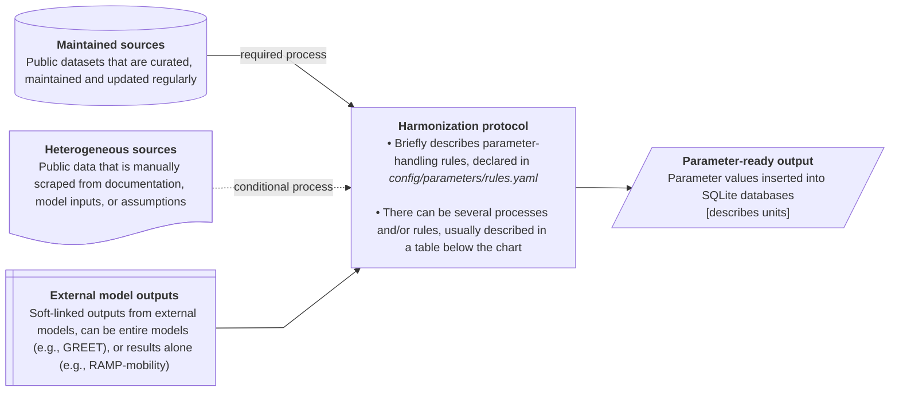
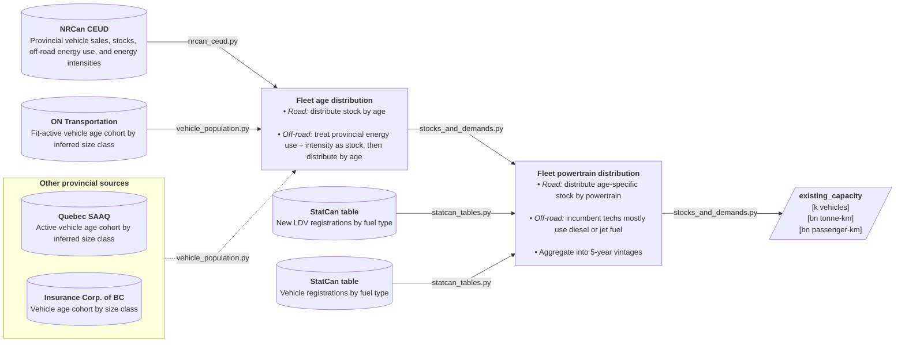
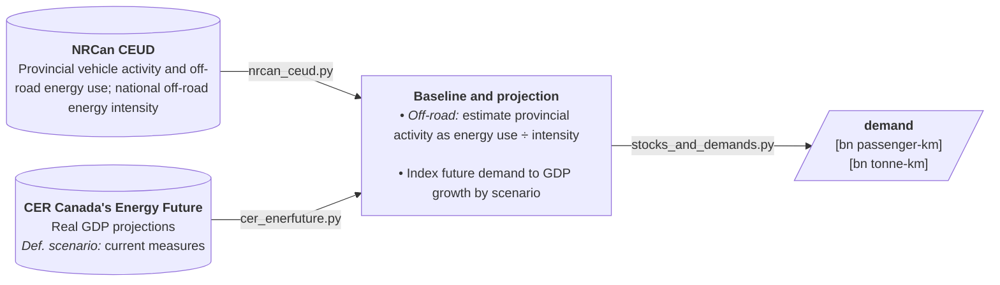
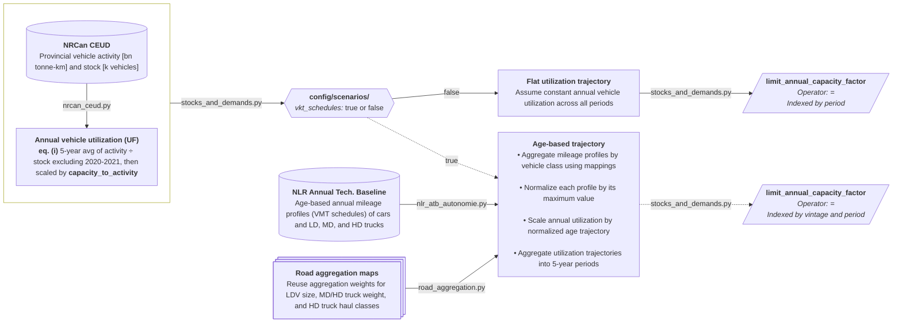
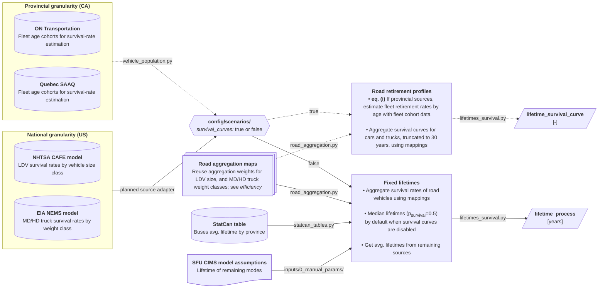
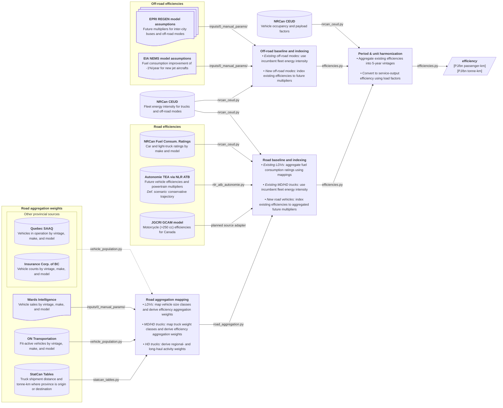
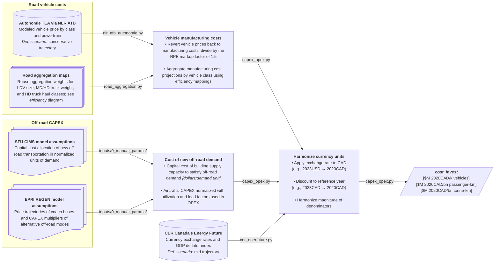
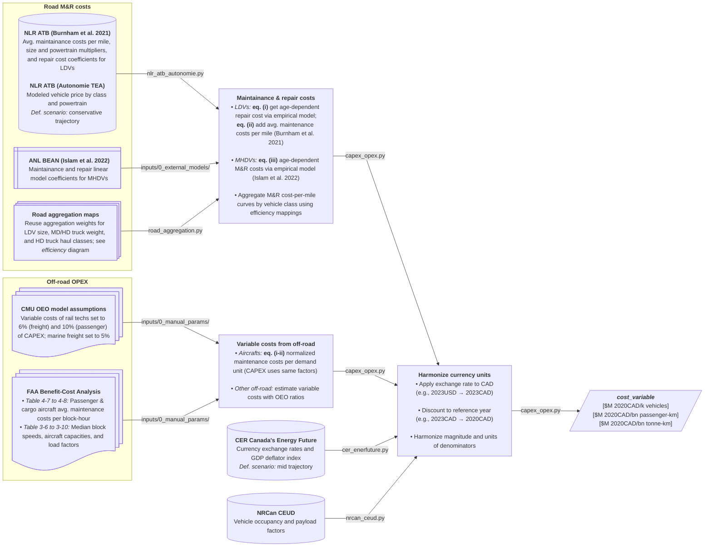

# Transportation parameter ETL lineage

This is the parameter-specific design reference for transportation ETL. Retrieve only
the section for the parameter family being changed. Each section records intended source
relationships, harmonization logic, equations, assumptions, and target parameter
outputs; some stages remain planned and should be checked against the current modules
before implementation.

Solid paths describe the default lineage and dashed paths describe conditional or
scenario-dependent alternatives. File and config labels identify the intended owner of
each operation. The legend below is local to these diagrams.

## Table of Contents

- [Flowchart legends](#flowchart-legends)
- [`existing_capacity`](#existing_capacity)
- [`demand`](#demand)
- [`limit_annual_capacity_factor`](#limit_annual_capacity_factor)
- [`lifetime_process` and `lifetime_survival_curve`](#lifetime_process-and-lifetime_survival_curve)
- [`efficiency`](#efficiency)
- [`cost_invest`](#cost_invest)
- [`cost_variable`](#cost_variable)


## Flowchart legends



## `existing_capacity`



| Harmonization rule                                     | Affected classes      | Description                                                                                                                          |
| ------------------------------------------------------ | --------------------- | ------------------------------------------------------------------------------------------------------------------------------------ |
| Fetch vehicle counts by inferred size class            | Cars and light trucks | Size classes are inferred from vehicle model and make                                                                                |
| Distribute stock by age                                | Road vehicles         | Distribute NRCan CEUD stocks over existing vintages using age cohort registrations                                                   |
| Treat energy use<sub>province</sub>÷intensity as stock | Off-road modes        | Air, rail and marine fleet size are estimated from the available supply capacity to satisfy demand by vintage (in demand units)      |
| Distribute stock by age                                | Off-road modes        | Available demand supply by vintage is estimated with a fleet turnover approximation assuming an avg. annual retirement of 1÷lifetime |
| Distribute stock<sub>age</sub> by powertrain           | Cars and light trucks | Each stock by vintage gets distributed over vehicle market shares by fuel type                                                       |
| Distribute stock<sub>age</sub> by powertrain           | MD trucks             | Each stock by vintage gets distributed over vehicle registration shares by fuel type – mainly diesel and gasoline                    |
## `demand`



| Harmonization rule                                                      | Affected classes | Description                                                                                                    |
| ----------------------------------------------------------------------- | ---------------- | -------------------------------------------------------------------------------------------------------------- |
| Estimate provincial activity as energy use<sub>province</sub>÷intensity | Off-road modes   | Provincial energy consumption [PJ] divided by national energy intensity [PJ/bn-tkm] as provincial demand proxy |
| Index future demand to GDP growth                                       | All              | Base year demand is indexed to future GDP growth projections by scenario                                       |
## `limit_annual_capacity_factor`


### Equations

```math
(i)\;\mathrm{UF[\text{-}]}=\frac{\mathrm{Activity[bn\;tonne\text{-}km/year]}}{\mathrm{Stock[k\;units]}\cdot \mathrm{C2A[bn\;t\text{-}km/k\;units\cdot year]}}
```

| Harmonization rule                          | Affected classes | Description                                                                                                                                                           |
| ------------------------------------------- | ---------------- | --------------------------------------------------------------------------------------------------------------------------------------------------------------------- |
| Annual utilization as activity÷stock ratios | Road vehicles    | Represents how much activity a unit of capacity can deliver annually. Utilization is scaled with an arbitrary `capacity_to_activity` factor to avoid near-zero values |
| Assume constant annual utilization          | Road vehicles    | Annual utilization derived from 5-year average ratios remains constant across all periods                                                                             |
| Aggregate profiles and normalize            | Road vehicles    | Aggregate annual mileage profiles by vehicle size/weight class using aggregation mappings (see `efficiency` flowchart) and apply max scaling to each series           |
| Scale utilization by normalized trajectory  | Road vehicles    | Baseline utilization is indexed through normalized age trajectories to obtain utilization as a function of vehicle age, mostly decaying                               |

## `lifetime_process` and `lifetime_survival_curve`



### Equations

```math
(i)\;\mathrm{Survival}_{age}=\frac{\mathrm{Stock}_{vintage,\;age}}{\mathrm{Stock}_{vintage,\;0}}
```

| Harmonization rule | Affected classes | Description |
| --- | --- | --- |
| Reuse road aggregation maps (see `efficiency`) | Cars, light trucks, and MD/HD trucks | Map source vehicle classes to the CANOE size and weight classes used to aggregate retirement profiles. |
| Survival curves are truncated to 30 years | Cars and trucks | Planned; the truncation rationale and implementation remain to be documented. |
| Median lifetimes compiled by default | All | When survival curves are disabled, use the median of a road-vehicle profile and configured average lifetimes for remaining classes. |

**Notes:**
- NHTSA CAFE model, used for cars and light trucks - survival rates table is inside parameters_ref.xlsx in 'Vehicle Age Data'!A3:E45, such file is downloaded at: <https://static.nhtsa.gov/nhtsa/downloads/CAFE/2024-FRM-LD-2b3-2027-2035/Central-Analysis/Central_Analysis_Inputs.zip>
- EIA NEMS model, used for medium and heavy trucks - survival rate table is inside trnhdv.xlsx in trnhdv!A86:D120, such file is downloaded from the NEMS repo: <https://github.com/EIAgov/NEMS/blob/main/input/tdm/trnhdvx.xlsx>
- Motorcycles, aircraft, rail, marine vessels, and other infrastructure use configured
  average or median lifetimes from `inputs/0_manual_params/`. Road technologies with
  survival curves also retain their median lifetimes there; a scenario-enabled curve
  supersedes the fixed-lifetime row for that technology.

## `efficiency`

*Note: Some technologies are not represented in this diagram; see
`config/parameters/rules.yaml` for implemented harmonization entries.*


| Harmonization rule                                | Affected classes           | Description                                                                                                                                                                                                      |
| ------------------------------------------------- | -------------------------- | ---------------------------------------------------------------------------------------------------------------------------------------------------------------------------------------------------------------- |
| Map size classes and derive aggregation weights   | Cars and light trucks      | Map vehicle make/model counts to size classes that align with NRCan efficiency ratings and Autonomie projections                                                                                                 |
| Map weight classes and derive aggregation weights | MD/HD trucks               | Map truck weight-rating counts to classes that align with Autonomie truck projection classes                                                                                                                     |
| Derive regional- and long-haul activity weights   | Heavy-duty trucks          | Group HD truck tonne-km into regional- and long-haul activity buckets to aggregate Autonomie haul classes                                                                                                        |
| Aggregate efficiency ratings using mappings       | Cars and light trucks      | Use size-class aggregation weights to convert model-level fuel consumption ratings into fleet-average efficiencies by powertrain                                                                                 |
| Use incumbent fleet energy intensity              | MD/HD trucks and off-road  | Use NRCan incumbent fleet energy intensities as proxies for existing technology efficiencies where fuel use is dominated by one fuel type                                                                        |
| Index existing efficiencies to future multipliers | All                        | Apply alternative-powertrain and future-period multipliers to existing efficiencies (e.g., 2030 battery-electric and 2040 fuel-cell multipliers)                                                                 |
| Special handling of buses                         | Transit, school, intercity | Use reported Autonomie values for existing and future transit and school bus efficiencies; use EPRI REGEN inputs for intercity buses                                                                             |
| Special handling of motorcycles                   | Motorcycles                | Use [PNNL GCAM](https://github.com/JGCRI/gcam-core/tree/master/input/gcamdata/inst/extdata/energy) Canada transportation inputs from `UCD_trn_data_CORE.csv` for future motorcycle (engine >250 cc) efficiencies |
| Convert to service-output efficiency units        | All                        | Convert source efficiencies (e.g., L/100 km or mpg) into demand units (e.g., bn tonne-km/PJ) with NRCan CEUD load factors; using HHVs.                                                                           |
## `cost_invest`

*Note: Some technologies are not represented in this diagram; see
`config/parameters/rules.yaml` for implemented harmonization entries.*


| Harmonization rule                                  | Affected classes                                                 | Description                                                                                                                                                                                                                                                                                                                         |     |
| --------------------------------------------------- | ---------------------------------------------------------------- | ----------------------------------------------------------------------------------------------------------------------------------------------------------------------------------------------------------------------------------------------------------------------------------------------------------------------------------- | --- |
| Reuse road aggregation maps                         | - Cars and light trucks<br>- MD/HD trucks<br>- Heavy-duty trucks | - Map vehicle make/model counts to size classes that align with NRCan efficiency ratings and Autonomie projections<br>- Map truck weight-rating counts to classes that align with Autonomie truck projection classes<br>- Group HD truck tonne-km into regional- and long-haul activity buckets to aggregate Autonomie haul classes |     |
| Revert vehicle prices back into manufacturing costs | Road vehicles                                                    | A manufacturing to retail price equivalent markup factor (RPE) of 1.5 is generally used in Autonomie TEA and TCO study series                                                                                                                                                                                                       |     |
| Aggregate manufacturing costs using mappings        | Cars and trucks                                                  | Use mapped weights to aggregate Autonomie projected manufacturing costs of cars, LD, MD, and HD trucks, and school and transit buses                                                                                                                                                                                                |     |
| CAPEX of new off-road demand capacity               | Off-road modes                                                   | Obtain input capital costs of building new supply capacity that satisfies off-road demand, derived as dollars per demand unit                                                                                                                                                                                                       |     |
| Special handling of buses                           | Intercity buses                                                  | Use EPRI REGEN vehicle purchase cost assumptions for intercity buses                                                                                                                                                                                                                                                                |     |
| Special handling of motorcycles                     | Motorcycles                                                      | Use [PNNL GCAM](https://github.com/JGCRI/gcam-core/tree/master/input/gcamdata/inst/extdata/energy) Canada transportation inputs from `UCD_trn_data_CORE.csv` for future motorcycle (engine >250 cc) purchase costs                                                                                                                  |     |
| Harmonize currency units                            | All                                                              | Convert values using foreign currencies and/or different dollar years into reference currency-year                                                                                        |

## `cost_variable`

*Note: Some technologies are not represented in this diagram; see
`config/parameters/rules.yaml` for implemented harmonization entries.*


### Road M&R equations

```math
(i)\; \mathrm{Repair}^{LDV}_{age}=\mathrm{size}\cdot \mathrm{pwt}\cdot C_{age}\cdot e^{\beta\cdot \mathrm{price}}
```

```math
(ii)\; \mathrm{M\&R}^{LDV}_{age}=\mathrm{Repair}^{LDV}_{age}+\mathrm{Maint.}^{LDV}
```

```math
(iii)\; \mathrm{M\&R}^{MHDV}_{age}=\mathrm{pwt}(m\cdot \mathrm{age}+b)
```

### Off-road M&R equations

```math
(i)\; \mathrm{M\&R}^{Air}=\frac{\mathrm{Cost\;per\;block\text{-}hour}}{\mathrm{Block\;speed}\cdot \mathrm{Seats}\cdot \mathrm{Load\;factor}}
```

```math
(ii)\; \mathrm{M\&R}^{Air}=\frac{\mathrm{Cost\;per\;block\text{-}hour}}{\mathrm{Block\;speed}\cdot \mathrm{Tonnes}\cdot \mathrm{Load\;factor}}
```

| Harmonization rule                                  | Affected classes                                                 | Description                                                                                                                                                                                                                                                                                                                         |     |
| --------------------------------------------------- | ---------------------------------------------------------------- | ----------------------------------------------------------------------------------------------------------------------------------------------------------------------------------------------------------------------------------------------------------------------------------------------------------------------------------- | --- |
| Reuse road aggregation maps                         | - Cars and light trucks<br>- MD/HD trucks<br>- Heavy-duty trucks | - Map vehicle make/model counts to size classes that align with NRCan efficiency ratings and Autonomie projections<br>- Map truck weight-rating counts to classes that align with Autonomie truck projection classes<br>- Group HD truck tonne-km into regional- and long-haul activity buckets to aggregate Autonomie haul classes |     |
| Vehicle prices used in repair cost empirical model | Road vehicles                                                    | Minimum suggested retail prices (MSRP) are simply manufacturing cost outputs from Autonomie scaled evenly by a markup factor of 1.5; these are used for repair cost estimates, as done in Burnham et al. 2021                                                                                                                                                                                                       |     |
| Aggregate M&R costs using mappings        | Cars and trucks                                                  | Use mapped weights to aggregate M&R cost curves of cars, LD, MD, and HD trucks, and and transit buses                                                                                                                                                                                                |     |
| Variable costs from off-road               | Off-road modes                                                   | - Estimate annual variable costs of rail and marine vessels with CAPEX-to-OPEX ratios used in the OEO model<br> - Estimate M&R costs per demand unit with empirical data from the FAA, converting miles to km and tons to tonnes; same apply annual utilization and load factors are used for CAPEX and OPEX                                                                                                                                                                                                        |     |
| Special handling of buses                           | School and intercity buses                                                  | Assume same CAPEX-to-OPEX ratios as those from transit buses                                                                                                                                                                                                                                                                |     |
| Special handling of motorcycles                     | Motorcycles                                                      | Use [PNNL GCAM](https://github.com/JGCRI/gcam-core/tree/master/input/gcamdata/inst/extdata/energy) Canada transportation inputs from `UCD_trn_data_CORE.csv` for future motorcycle (engine >250 cc) M&R costs                                                                                                                  |     |
| Harmonize currency units                            | All                                                              | - Convert values using foreign currencies and/or different dollar years into reference currency-year<br>- Harmonize denominators; convert miles into km and multiply by NRCan CEUD load factors
