Solid paths describe the default lineage and dashed paths describe conditional or
scenario-dependent alternatives. File and config labels identify the intended owner of
each operation. The legend below is local to these diagrams.

## Table of Contents

- [Flowchart legends](#flowchart-legends)
- [`existing_capacity`](#existing_capacity)
- [`demand`](#demand)
- [`limit_annual_capacity_factor`](#limit_annual_capacity_factor)
- [`lifetime_tech` and `lifetime_survival_curve`](#lifetime_tech-and-lifetime_survival_curve)
- [`efficiency`](#efficiency)
- [`cost_invest`](#cost_invest)
- [`cost_variable`](#cost_variable)

## Flowchart Legends

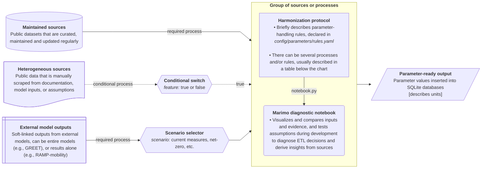

## `existing_capacity`

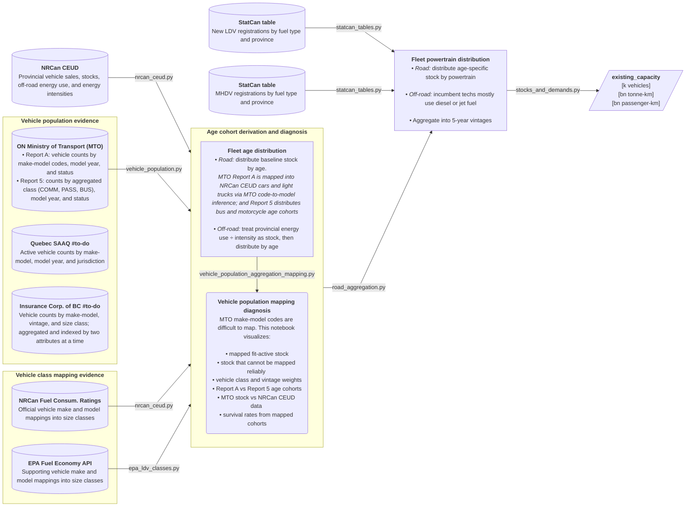

| Harmonization rule                                     | Affected classes      | Description                                                                                                                          |
| ------------------------------------------------------ | --------------------- | ------------------------------------------------------------------------------------------------------------------------------------ |
| Fetch vehicle counts by inferred size class            | Cars and light trucks | Map make-model-vintage keys with the reviewed NRCan and FuelEconomy.gov evidence crosswalk                                       |
| Distribute stock by age                                | Road vehicles         | Distribute NRCan CEUD stocks over existing vintages using age cohort registrations                               |
| Treat energy use<sub>province</sub>÷intensity as stock | Off-road modes        | Air, rail, and marine fleet size are estimated from the available supply capacity to satisfy demand by vintage (in demand units)      |
| Distribute stock by age                                | Off-road modes        | Available demand supply by vintage is estimated with a fleet turnover approximation assuming an avg. annual retirement of 1÷lifetime |
| Distribute stock<sub>age</sub> by powertrain           | Cars and light trucks | Each stock by vintage gets distributed over vehicle market shares by fuel type                                                       |
| Distribute stock<sub>age</sub> by powertrain           | MD trucks             | Each stock by vintage gets distributed over vehicle registration shares by fuel type – mainly diesel and gasoline                    |

## `demand`

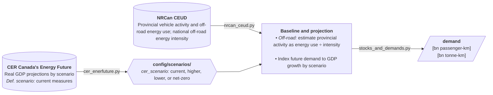

| Harmonization rule                                                      | Affected classes | Description                                                                                                    |
| ----------------------------------------------------------------------- | ---------------- | -------------------------------------------------------------------------------------------------------------- |
| Estimate provincial activity as energy use<sub>province</sub>÷intensity | Off-road modes   | Provincial energy consumption [PJ] divided by national energy intensity [PJ/bn-tkm] as provincial demand proxy |
| Index future demand to GDP growth                                       | All              | Base year demand is indexed to future GDP growth projections by scenario                                       |

## `limit_annual_capacity_factor`

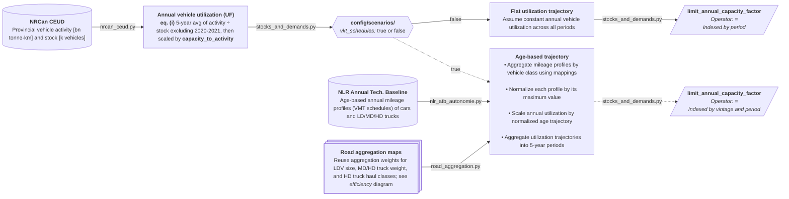

### Equations

```math
(i)\;\mathrm{UF[\text{-}]}=\frac{\mathrm{Activity[bn\;tonne\text{-}km/year]}}{\mathrm{Stock[k\;units]}\cdot \mathrm{C2A[bn\;t\text{-}km/k\;units\cdot year]}}
```

| Harmonization rule                          | Affected classes | Description                                                                                                                                                           |
| ------------------------------------------- | ---------------- | --------------------------------------------------------------------------------------------------------------------------------------------------------------------- |
| Annual utilization as activity÷stock ratios | Road vehicles    | Represents how much activity a unit of capacity can deliver annually. Utilization is scaled with an arbitrary `capacity_to_activity` factor to avoid near-zero values |
| Assume constant annual utilization          | Road vehicles    | Annual utilization derived from 5-year average ratios remains constant across all periods                                                                             |
| Aggregate profiles and normalize            | Road vehicles    | Aggregate annual mileage profiles by vehicle size/weight class using aggregation mappings (see `efficiency` flowchart) and apply max scaling to each series           |
| Scale utilization by normalized trajectory  | Road vehicles    | Baseline utilization is indexed through normalized age trajectories to obtain utilization as a function of vehicle age, mostly decaying                               |

## `lifetime_tech` and `lifetime_survival_curve`

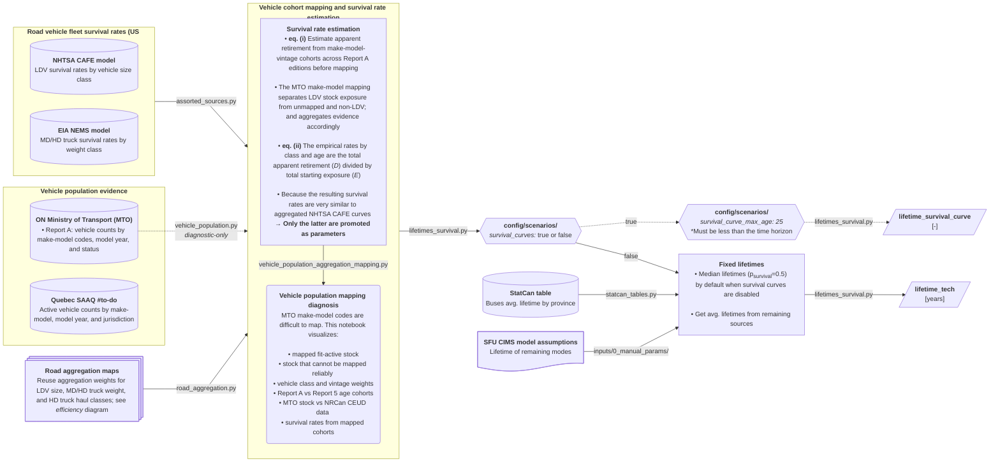

### Equations

```math
(i)\quad r^{\mathrm{MTO}}_{p,k,v,a}=\frac{N_{p,k,v,a+1}}{N_{p,k,v,a}}; \qquad a=t-v
```
where $r$: apparent MTO-key survival rate, $p$: Report A class (PASS or COMM), $k$: abbreviated MTO make-model key, $v$: vintage of that key, $a$: vehicle age, $t$: Report A edition year, and $N_{p,k,v,a}$: observed FIT_ACTIVE stock.

```math
(ii)\quad R^{\mathrm{MTO}}_{c,a}=1 - \frac{\sum_v D_{c,v,a}}{\sum_v E_{c,v,a}}; \qquad E_{c,v,a}=\sum_{p,k → m(k,v)=c}N_{p,k,v,v+a}; \qquad D_{c,v,a}=\sum_{p,k → m(k,v)=c}\left(N_{p,k,v,v+a}-N_{p,k,v,v+a+1}\right)
```
where $R$: aggregated vehicle class survival rate, $c$: target vehicle class, $m(k,v)$ reviewed class assigned to a particular MTO-key and vintage, $E$: pooled starting exposure—the sum of beginning-of-transition stock contributing to a class-vintage-age estimate, $D$: aggregated apparent retirements.

```math
S_c(a+1)=S_c(a)R_{c,a}; \qquad S_c(0)=1
```
The cumulative MTO survival is a product of those empirical rates with an explicit age-zero baseline, following NHTSA indexing method. Because no vehicle-level identifier links editions, **apparent retirements mix physical retirement with administrative status changes, migration, imports, re-registration, and MTO-key changes**.

| Harmonization rule | Affected classes | Description |
| --- | --- | --- |
| Standardize source survival schedules | Road vehicles | Keep NHTSA cumulative survival values as reported. Convert NEMS annual scrappage rates into cumulative survival, starting at 100% at age zero. |
| Map source schedules to model classes | Road vehicles | Assign NHTSA schedules to car and light-truck classes, using the latest Wards shares to combine the light-truck schedules. Keep NEMS medium- and heavy-truck weight classes separate unless reviewed aggregation weights are available. |
| Compile fixed lifetimes | All | When survival curves are disabled, keep configured fixed lifetimes and fill missing road-vehicle values with the first age at which the accepted survival curve reaches 50% or less. Use StatCan or configured average lifetimes for the remaining modes. |
| Select the lifetime representation | All | Use `survival_curves` to select fixed lifetimes or accepted road-vehicle curves. `survival_curve_max_age` limits the curve and stock-age horizon; it is not an individual technology lifetime. |
| Estimate MTO annual changes before mapping | Cars and light trucks | Compare `FIT_ACTIVE` counts for the same make-model and model year in consecutive Report A editions. Keep increases as observed rather than forcing every annual ratio between zero and one. |
| Map and aggregate MTO diagnostics | Cars and light trucks | Attach reviewed vintage-range mappings only after the raw annual changes are calculated. Sum the starting and following counts by NLR and NRCan CEUD class and age before calculating class-level rates. |
| Limit and check MTO diagnostic evidence | Cars and light trucks | Use starting ages 0 through 35, including eligible pre-2000 model years. Report mapping coverage, age gaps, unusual rates, and sample support; do not fill missing ages or the older tail with NHTSA or NEMS values. |
| Keep MTO results diagnostic | Cars and light trucks | Treat the results as changes in registered stock, not direct observations of vehicle retirement. Compare them with accepted NHTSA curves only after the MTO series is derived; the current decision keeps NHTSA curves as CANOE parameters. |

**Notes:**

- **Execution boundary.** The default `parameterization.lifetimes_survival` command
  publishes accepted source-based curves and source-derived median lifetimes without
  loading MTO history or its reviewed mapping. `--mto-diagnostics` publishes the MTO
  review evidence; `--all` runs both paths.
- Detailed MTO filters, evidence checks, and comparisons are documented in
  `docs/insights/vehicle_population_aggregation_mapping.py`.

## `efficiency`

*Note: Some technologies are not represented in this diagram; see
`config/parameters/rules.yaml` for implemented harmonization entries.*

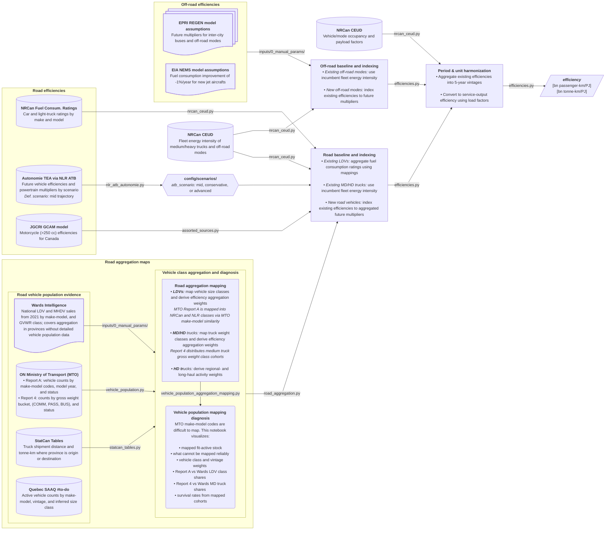

| Harmonization rule | Affected classes | Description |
| --- | --- | --- |
| Map size classes and derive aggregation weights | Cars and light trucks | - Map MTO make-model-vintage keys from normalized NRCan Ratings, FuelEconomy.gov, and NHTSA vPIC API evidence<br>- Derive latest-snapshot fleet composition weights by mapped vehicle class |
| Map weight classes and derive aggregation weights | MD/HD trucks | Map truck weight-rating counts to classes that align with Autonomie truck projection classes |
| Derive regional- and long-haul activity weights | Heavy-duty trucks | Group HD truck tonne-km into regional- and long-haul activity buckets to aggregate Autonomie haul classes |
| Aggregate efficiency ratings using mappings | Cars and light trucks | Use size-class aggregation weights to convert model-level fuel consumption ratings into fleet-average efficiencies by powertrain |
| Use incumbent fleet energy intensity | MD/HD trucks and off-road | Use NRCan incumbent fleet energy intensities as proxies for existing technology efficiencies where fuel use is dominated by one fuel type |
| Index existing efficiencies to future multipliers | All | Apply alternative-powertrain and future-period multipliers to existing efficiencies (e.g., 2030 battery-electric and 2040 fuel-cell multipliers) |
| Special handling of buses | Transit, school, intercity | Use reported Autonomie values for existing and future transit and school bus efficiencies; use EPRI REGEN inputs for intercity buses |
| Special handling of motorcycles | Motorcycles | Use [PNNL GCAM](https://github.com/JGCRI/gcam-core/tree/master/input/gcamdata/inst/extdata/energy) Canada transportation inputs from `UCD_trn_data_CORE.csv` for future motorcycle (engine >250 cc) efficiencies |
| Convert to service-output efficiency units | All | Convert source efficiencies (e.g., L/100 km or mpg) into demand units (e.g., bn tonne-km/PJ) with NRCan CEUD load factors; using HHVs. |

### Vehicle make-model to vehicle classes mapping

`config/parameters/vehicle_size_class_map.csv` inherits all reviewed make-model mappings; see a few examples:

| **MTO Make-Model** | **Mapped Model** | **NRCan Fuel Ratings** | **Autonomie TEA (NLR ATB)** | **NRCan CEUD** |
| ------------------ | ---------------- | ---------------------- | ----------------- | -------------- |
| KIA OSL, KIA SOU   | **Kia Soul**     | Station Wagon: Small   | Midsize           | Car            |
| FORD F/E, FORD SRW | **Ford F-150**   | Pickup truck: Standard | Pickup            | Light Truck    |
| HON UDY, HON ODY   | **Toyota RV4**   | Minivan                | Midsize SUV       | Light Truck    |

## `cost_invest`

*Note: Some technologies are not represented in this diagram; see
`config/parameters/rules.yaml` for implemented harmonization entries.*

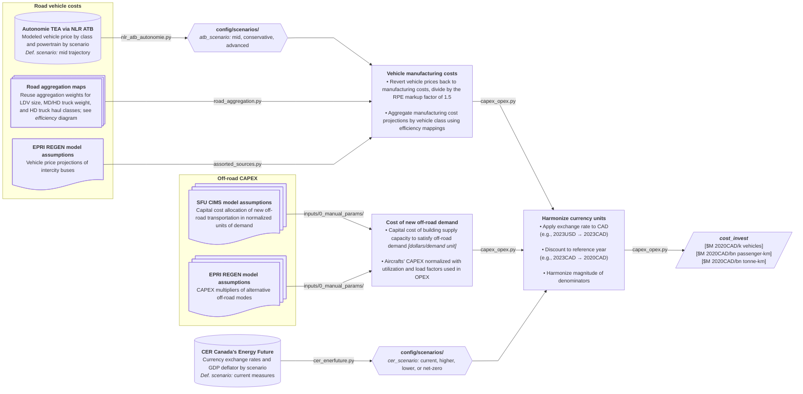

| Harmonization rule | Affected classes | Description |
| --- | --- | --- |
| Reuse road aggregation maps | - Cars and light trucks<br>- MD/HD trucks<br>- Heavy-duty trucks | - Map vehicle make/model counts to size classes that align with NRCan efficiency ratings and Autonomie projections<br>- Map truck weight-rating counts to classes that align with Autonomie truck projection classes<br>- Group HD truck tonne-km into regional- and long-haul activity buckets to aggregate Autonomie haul classes |
| Revert vehicle prices back into manufacturing costs | Road vehicles | A manufacturing to retail price equivalent markup factor (RPE) of 1.5 is generally used in Autonomie TEA and TCO study series |
| Aggregate manufacturing costs using mappings | Cars and trucks | Use mapped weights to aggregate Autonomie projected manufacturing costs of cars, LD, MD, and HD trucks, and school and transit buses |
| CAPEX of new off-road demand capacity | Off-road modes | Obtain input capital costs of building new supply capacity that satisfies off-road demand, derived as dollars per demand unit |
| Special handling of buses | Intercity buses | Use EPRI REGEN vehicle purchase cost assumptions for intercity buses |
| Special handling of motorcycles | Motorcycles | Use [PNNL GCAM](https://github.com/JGCRI/gcam-core/tree/master/input/gcamdata/inst/extdata/energy) Canada transportation inputs from `UCD_trn_data_CORE.csv` for future motorcycle (engine >250 cc) purchase costs |
| Harmonize currency units | All | Convert values using foreign currencies and/or different dollar years into reference currency-year |

## `cost_variable`

*Note: Some technologies are not represented in this diagram; see
`config/parameters/rules.yaml` for implemented harmonization entries.*

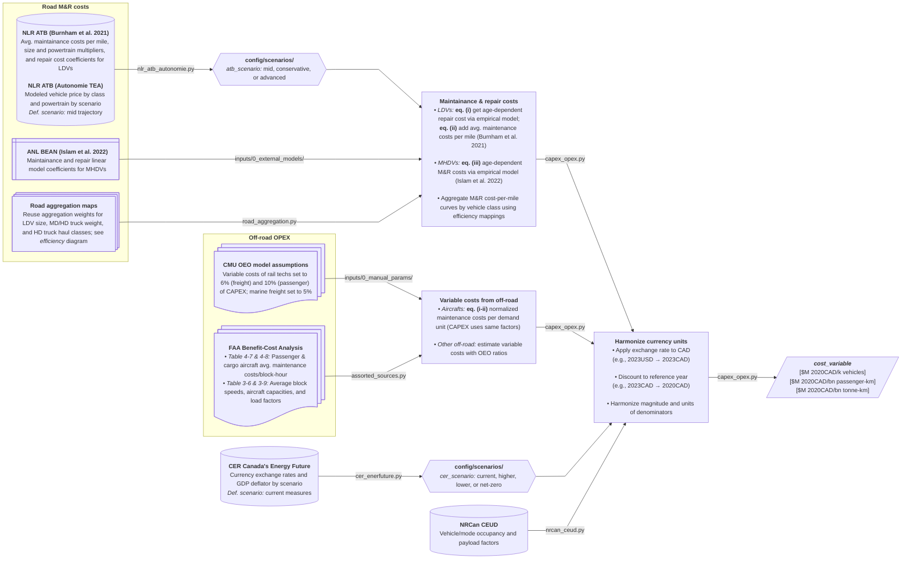

### Road M&R equations

```math
(i)\; \mathrm{Repair}^{LDV}_{age}=\mathrm{size}\cdot \mathrm{pwt}\cdot C_{age}\cdot e^{\beta\cdot \mathrm{price}}
```

```math
(ii)\; \mathrm{M\&R}^{LDV}_{age}=\mathrm{Repair}^{LDV}_{age}+\mathrm{Maint.}^{LDV}
```

```math
(iii)\; \mathrm{M\&R}^{MHDV}_{age}=\mathrm{pwt}(m\cdot \mathrm{age}+b)
```

### Off-road M&R equations

```math
(i)\; \mathrm{M\&R}^{Air}=\frac{\mathrm{Cost\;per\;block\text{-}hour}}{\mathrm{Block\;speed}\cdot \mathrm{Seats}\cdot \mathrm{Load\;factor}}
```

```math
(ii)\; \mathrm{M\&R}^{Air}=\frac{\mathrm{Cost\;per\;block\text{-}hour}}{\mathrm{Block\;speed}\cdot \mathrm{Tonnes}\cdot \mathrm{Load\;factor}}
```

| Harmonization rule | Affected classes | Description |
| --- | --- | --- |
| Reuse road aggregation maps | - Cars and light trucks<br>- MD/HD trucks<br>- Heavy-duty trucks | - Map vehicle make/model counts to size classes that align with NRCan efficiency ratings and Autonomie projections<br>- Map truck weight-rating counts to classes that align with Autonomie truck projection classes<br>- Group HD truck tonne-km into regional- and long-haul activity buckets to aggregate Autonomie haul classes |
| Vehicle prices used in repair cost empirical model | Road vehicles | Minimum suggested retail prices (MSRP) are simply manufacturing cost outputs from Autonomie scaled evenly by a markup factor of 1.5; these are used for repair cost estimates, as done in Burnham et al. 2021 |
| Aggregate M&R costs using mappings | Cars and trucks | Use mapped weights to aggregate M&R cost curves of cars, LD, MD, and HD trucks, and transit buses |
| Variable costs from off-road | Off-road modes | - Estimate annual variable costs of rail and marine vessels with CAPEX-to-OPEX ratios used in the OEO model<br>- Estimate M&R costs per demand unit with empirical data from the FAA, converting miles to km and tons to tonnes; same annual utilization and load factors are used for CAPEX and OPEX |
| Special handling of buses | School and intercity buses | Assume same CAPEX-to-OPEX ratios as those from transit buses |
| Special handling of motorcycles | Motorcycles | Use [PNNL GCAM](https://github.com/JGCRI/gcam-core/tree/master/input/gcamdata/inst/extdata/energy) Canada transportation inputs from `UCD_trn_data_CORE.csv` for future motorcycle (engine >250 cc) M&R costs |
| Harmonize currency units | All | - Convert values using foreign currencies and/or different dollar years into reference currency-year<br>- Harmonize denominators; convert miles into km and multiply by NRCan CEUD load factors |

### Notes

FAA source PDFs: [Section 3 — Aircraft Capacity and Utilization Factors](https://www.faa.gov/regulations_policies/policy_guidance/benefit_cost/econ-value-section-3-capacity.pdf) and [Section 4 — Aircraft Operating Costs](https://www.faa.gov/regulations_policies/policy_guidance/benefit_cost/econ-value-section-4-op-costs.pdf).

## `emission_embodied`

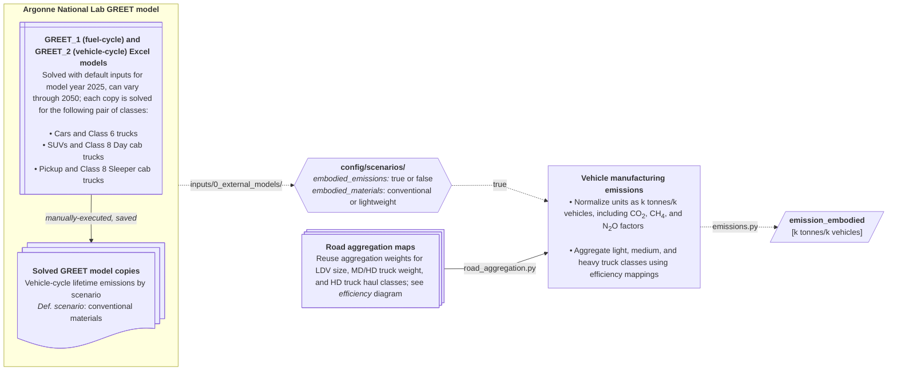

| Harmonization rule | Affected classes | Description |
| --- | --- | --- |
| Reuse road aggregation maps | - Cars and LD trucks<br>- MD/HD trucks<br>- Heavy-duty trucks | - Map vehicle make/model counts to size classes that align with NRCan efficiency ratings and Autonomie projections<br>- Map truck weight-rating counts to classes that align with Autonomie truck projection classes<br>- Group HD truck tonne-km into regional- and long-haul activity buckets to aggregate Autonomie haul classes |
| Vehicle manufacturing emissions | Cars and trucks | - Default vehicle-lifetime emissions from GREET-2 are extracted directly, solved for model year 2025 and normalized by k tonnes per thousand vehicles manufactured; model years 2030 through 2050 remain available.<br>- GREET 2 calculates the emissions associated with the production and processing of vehicle materials, the manufacturing and assembly of the vehicle, and the EOL decomissioning. EOL credits from material recycling are not considered. Emissions from the transportation of raw and processed materials for each process step are neglected. |

## `capacity_factor_tech` for BEV charging profiles; pending refactor

A light-duty BEV charging demand profile is an aggregated hourly time-series from charging events across 8,760 hours with 15-min resolution from a simulated representative fleet of 2,500 BEVs using RAMP-mobility. They're currently not fetched by canoe-transportation v2 and are taken directly from the `legacy_backend/` evidence directory. New charging profiles with updated assumptions are pending simulation. #to-do

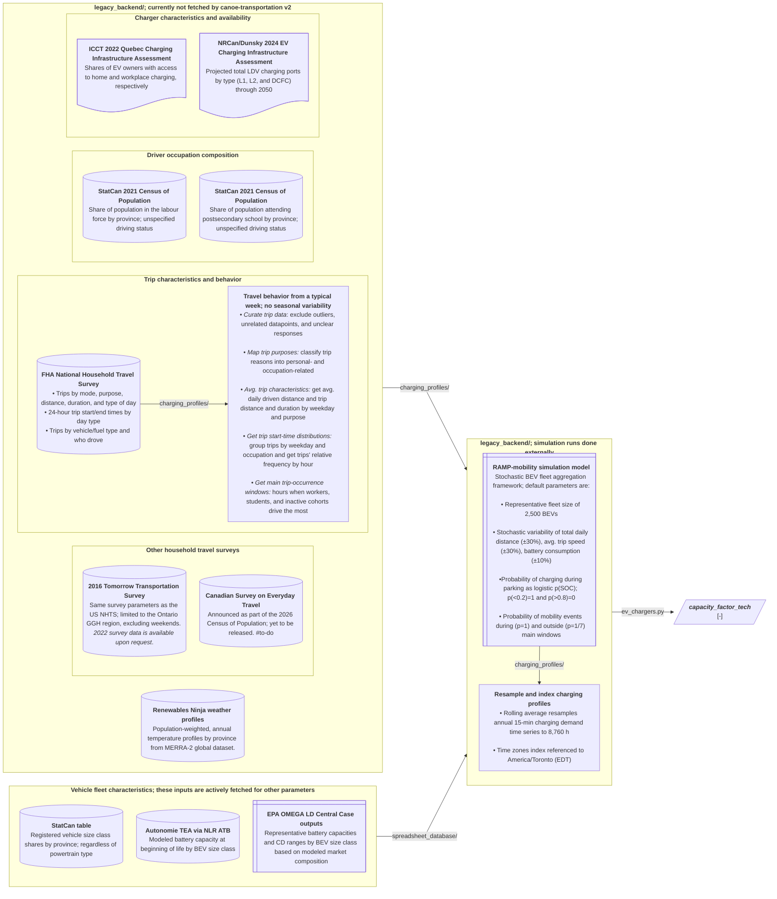

## EV charger parameters

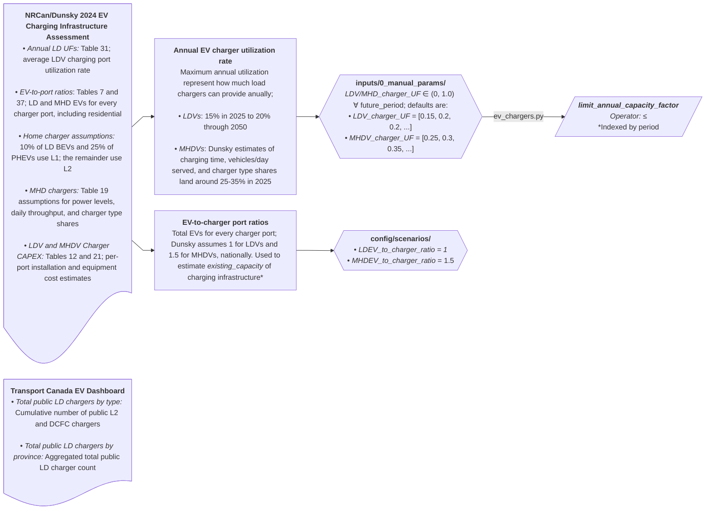

## Market share and technology adoption constraints

```mermaid
---
config:
  layout: dagre
  flowchart:
    nodeSpacing: 35
    rankSpacing: 50
    wrappingWidth: 250
    curve: linear
---
flowchart LR
  %% --- Sources ---


  %% --- Processes ---


  %% --- Hyperlinks ---
```

## Compact manual parameter selectors

Manual lifetime, efficiency, and cost tables use `technology_class` as an exact
selector for `technology.csv` `category`. When present, `powertrain` selects
`sub_category`; configured aliases reconcile reviewed label variants, `all`
selects the complete category, `remainder` excludes explicit peer selectors for
the same parameter, and a terminal year such as `_2035` is retained as
`selector_year`. `parameterization.manual_parameters` never edits the manual
tables: it publishes the row-to-technology expansion, reconciliation, registry,
and unmatched-selector findings under `inputs/1_interim/`.
