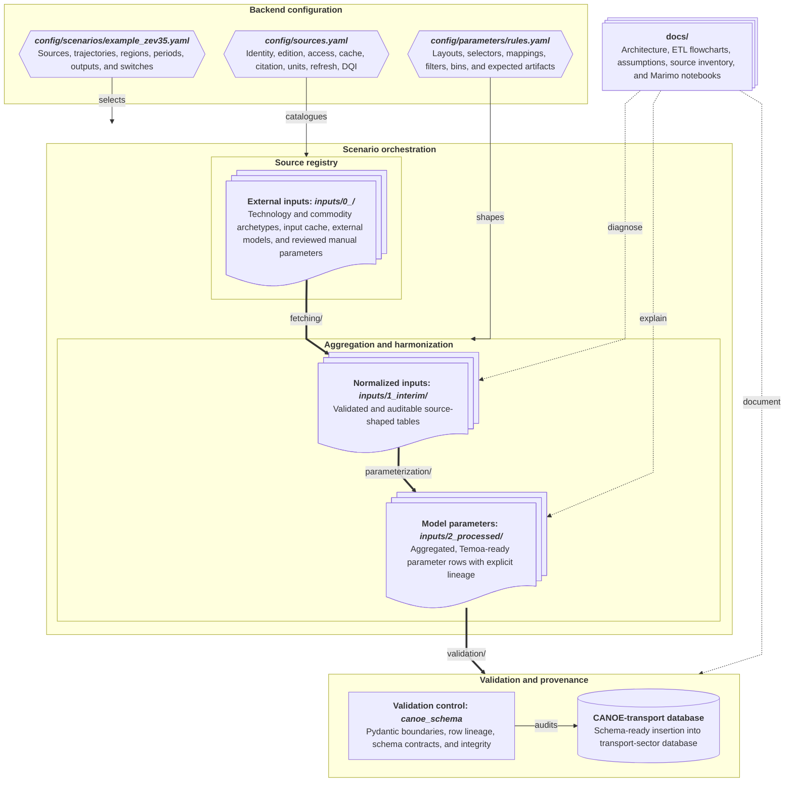

# CANOE transportation backend v2.0: executive summary

## 1. Purpose and intended outcome

The CANOE transportation backend converts heterogeneous transportation evidence into
validated parameter rows and scenario-ready SQLite databases for Temoa/CANOE Canadian
energy-system modelling. Version 2.0 replaces the legacy Excel-centred compiler with a
configuration-owned Python backend in which sources, assumptions, transformations,
validation results, and accepted differences can be inspected independently.

The first acceptance threshold is a minimum viable, legacy-equivalent baseline:
reproduce the accepted legacy representation within documented tolerances, explain
systemic differences, and record any intentional source or assumption changes. New
scenarios, behavioural assumptions, and transportation-representation experiments are
post-baseline extensions rather than substitutes for parity.

## 2. Backend at a glance

The [source registry](../config/sources.yaml) owns external identity and provenance;
[harmonization rules](../config/parameters/rules.yaml) own source-layout and
transformation contracts; reusable factors belong in
[conversion configuration](../config/parameters/conversion.yaml); and
[scenario YAML](../config/scenarios/legacy_reproduction.yaml) selects editions,
trajectories, regions, periods, outputs, and active switches. Canonical locations are
owned by [path configuration](../config/paths.yaml). Modular Python performs acquisition
and transformation, while Snakemake coordinates only stable dependencies and artifacts.
Pydantic and the pinned `canoe-schema` package form trust boundaries before atomic
SQLite publication.

The [backend architecture](backend_architecture.md) is the ownership reference. The
[ETL flowcharts](etl_flowcharts.md) document parameter-specific provenance,
harmonization, equations, and intended outputs; the
[source inventory](source_inventory.md) discusses source families without replacing the
registry. Legacy workbooks and databases remain read-mostly comparison evidence.
Marimo notebooks are the interactive diagnostics layer and may eventually expose
configuration choices to users who should not need to edit Python, but that layer is
currently focused rather than comprehensive.

Reproducibility is therefore collective: Git records reviewed changes; YAML owns
selectable configuration; documented paths separate cached, interim, processed, and
published artifacts; modular Python keeps transformations testable; manifests and logs
record execution; and validation and parity reports make each deterministic build
auditable.

## 3. Expected backend outcomes

### Baseline / minimum viable backend

A completed baseline should provide:

- reproducible, scenario-ready CANOE/Temoa SQLite databases built from registered inputs;
- automated acquisition where practicable and deterministic cached replay where it is
  not, including registered external-model and reviewed manual inputs;
- auditable source-native caches, normalized interim evidence, and parameter-ready
  processed artifacts with explicit provenance, units, mappings, assumptions, and
  transformations;
- scenario selection of source editions, trajectories, regions, periods, outputs, and
  modelling switches without duplicating source metadata or transformation rules;
- Pydantic validation at configuration and source interfaces, `canoe-schema` validation
  at the row/SQLite seam, and provenance, key, foreign-key, and integrity checks before
  publication;
- parameter-level comparison with accepted legacy evidence, with tolerances and accepted
  differences recorded rather than silently reconciled; and
- documentation that lets reviewers evaluate evidence and modelling choices without
  first reading the Python implementation.

### Post-baseline extensibility

Once baseline reproduction is accepted, the same boundaries should support alternate
source editions, trajectories, diagnostics, and representation experiments without
forking the pipeline or obscuring which assumptions changed. The architecture is also a
foundation for broader Marimo exploration, but diagnostic evidence must not be treated
as an accepted modelling assumption until it passes the relevant review and validation
gates.

## 4. Current progress — retrospective

| Development stage | What was established | Why it matters | Current interpretation |
| --- | --- | --- | --- |
| Repository, configuration, and reproducibility controls | Canonical artifact paths; separate source, rules, conversion, and scenario registries; typed configuration; deterministic source identifiers; runtime hygiene and logging conventions | Selectable choices and provenance no longer depend on hidden spreadsheet cells or ad hoc local paths | The control architecture is established. Some scenario fields intentionally remain placeholders and do not activate transformations. |
| Source registry, fetching, caching, and normalization | Independently registered evidence from NRCan, Statistics Canada, the Canada Energy Regulator (CER), Ontario MTO, National Laboratory of the Rockies (NLR)/Argonne, EPRI REGEN, CIMS, FAA, NHTSA, EIA, GCAM, FuelEconomy.gov, and reviewed manual inputs; physical checks, manifests, warnings, and multiple offline replay paths | Source editions and native evidence can be refreshed or audited without treating a workbook as the source of truth | Acquisition readiness is strong. “Fetched” or “registered” means the input is available under its source contract; it does not mean the related parameter or SQLite row exists. National NRCan CEUD components are cached and normalized. |
| Validation, schema, and database bootstrap | Pydantic request/configuration boundaries; pinned `canoe-schema` v4 DDL and row models; validated insertion and provenance interfaces; atomic structural database publication; integrity checks; limited legacy comparison | The final database seam can reject invalid, conflicting, or untraceable rows before publication | The present build path proves structural technology/commodity loading and the parameter-row validation seam. It does not yet construct a complete transportation database, and current legacy comparison is limited to structural tables. |
| Parameter ETL and lineage documentation | Parameter roadmaps for capacity, demand, utilization, lifetimes/survival, efficiency, and costs; normalized audit artifacts; compact manual-selector resolution; focused stock, road-aggregation, and lifetime transformations | Parameter families have explicit intended lineage and reusable evidence rather than opaque spreadsheet formulas | The flowcharts describe intended outputs, not blanket completion. Several acquisition and diagnostic transformations exist, while the parameter-ready processed stage and end-to-end family-to-SQLite integration remain unfinished. |
| Road-fleet mapping and empirical diagnostics | Reviewed make-model-vintage mapping evidence, unresolved-stock reporting, fleet composition/age artifacts, apparent-retention comparisons, and a substantial Marimo diagnostic | Provincial evidence supports finer investigation of fleet age, class composition, and turnover than legacy national Wards aggregates, while exposing incompatible classifications and ambiguous mappings | This is diagnostic progress, not an adopted survival assumption. Material fleet stock remains unresolved; Ontario apparent registration retention is not a physical survival probability, and the baseline retains legacy source schedules where empirical gates do not pass. |
| Baseline integration and parity | A legacy-reproduction scenario, compact orchestration for stable stages, a structural SQLite artifact, and validation interfaces for future parameter insertion | The repository can integrate completed stages without moving ETL logic into the workflow layer | Baseline integration is active work. Parameter transformation is disabled in the representative scenario, parameter tables are not yet populated end to end, and parameter-level parity has not been demonstrated. |

The source architecture also improves the evidence base without prescribing new model
behaviour. Recent editions of major public and external-model evidence can be registered
and traced independently; Ontario make-model-vintage observations permit more granular
fleet investigation; and limitations in the legacy Wards-based national mapping or
cross-source class compatibility remain visible rather than being force-matched.

## 5. Near-term completion criteria

The baseline/MVP is complete only when the configured legacy-reproduction build is a
full transport database, not merely a collection of fetched inputs, interim diagnostics,
or structural tables. Completion requires all of the following:

1. Confirm that every source required by baseline parameter rows is acquired or
   explicitly registered, validated, and scenario-selected. The national NRCan CEUD
   inputs are no longer a known acquisition gap; the remaining task is a baseline-wide
   source-to-parameter coverage audit.
2. Operationalize the documented ETL roadmaps into deterministic parameter-ready
   outputs for every required parameter family, preserving source-native audit columns
   and reporting drops, fallbacks, mapping gaps, and unit conversions.
3. Construct each final row with the relevant `canoe-schema` model, register provenance
   before dependent rows, and insert the validated rows through the existing atomic
   database seam.
4. Enable and run parameter transformation for the representative scenario, producing a
   complete scenario-ready SQLite database plus logs and validation evidence from
   version-controlled configuration and registered inputs.
5. Compare baseline parameter tables against the accepted legacy database using
   parameter-appropriate keys and tolerances. Separate systemic implementation errors
   from explainable source-edition, classification, unit, or assumption differences.
6. Resolve implementation errors, then document and approve any remaining parity gaps,
   including the evidence, rationale, and validation result for each accepted difference.

These criteria define acceptance; detailed sequencing belongs in task-specific
ExecPlans rather than this orientation document.

## 6. Potential enhancements after baseline

These are research and extensibility opportunities, not committed scope or an execution
roadmap.

| Potential enhancement | Modelling value | Approx. difficulty | Dependency / reason to defer |
| --- | --- | --- | --- |
| GREET air-pollutant emission factors | Add technology- and fuel-sensitive criteria-air-pollutant accounting alongside energy and greenhouse-gas results | Low | Requires a reviewed emissions scope, Canadian applicability mapping, and stable technology/fuel identifiers; the current GREET use is narrower. |
| FASTSim-based alternative LDV and MHDV technology trajectories | Provide an independently derived sensitivity for vehicle efficiency, performance, and cost progress | Medium | Baseline efficiency/cost construction and class aggregation must be stable before alternate trajectories can be compared cleanly. |
| Richer LDV charging profiles using synthetic-population and geospatial methods, potentially informed by future Canadian travel-survey evidence | Represent where and when charging demand occurs and its interaction with power-system peaks | High | Needs travel-behaviour evidence, spatial/temporal synthesis, time-slice interfaces, and validation beyond the current scenario placeholder. |
| Integration of related battery-material-flow and HDV charging research | Connect vehicle adoption to charging infrastructure, battery demand, and upstream material implications | Medium–high | Depends on stable vehicle trajectories, sector-coupling boundaries, charging representations, and compatible external research outputs. |
| Consumer heterogeneity and preferences | Represent differentiated adoption decisions, access constraints, and behavioural response | Medium–high | Requires defensible segmentation and choice formulations that would change the baseline representation. |
| Modal shift representation | Allow demand to move among road, rail, transit, active, marine, and air modes under policy or cost changes | Medium–high | Needs comparable service definitions, cross-modal costs, constraints, and behavioural evidence after single-mode baseline parity is secure. |
| Transportation infrastructure constraints and material requirements, with improved rail representation | Represent charging/refuelling networks, capacity bottlenecks, infrastructure build-out, materials, and more credible rail technologies | Medium–high | Requires new network, capacity, cost, material, and rail-operation evidence plus decisions about coupling to other CANOE sectors. |
