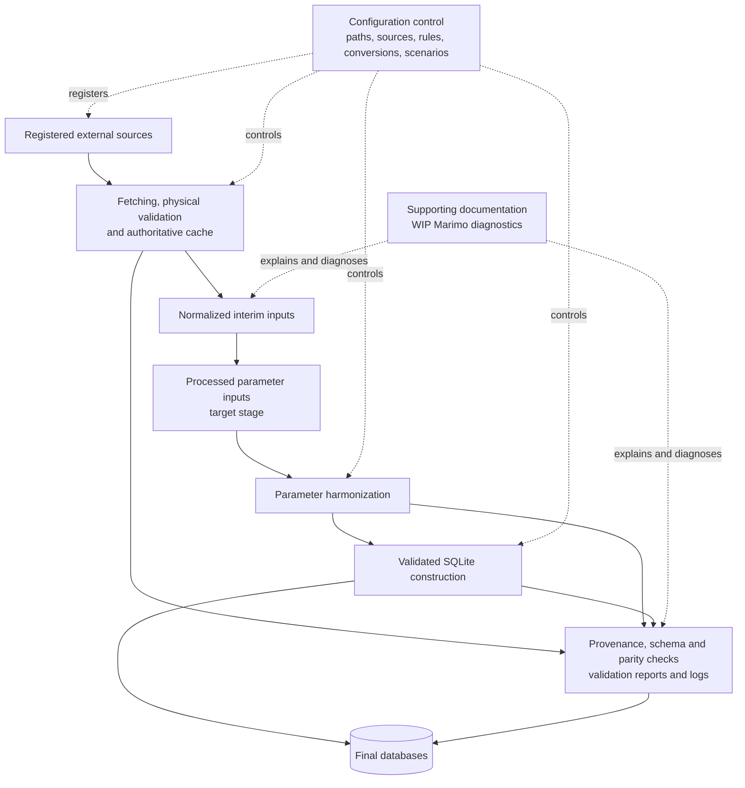

# CANOE transportation backend v2.0: executive summary

## Purpose

The transportation backend turns heterogeneous transport evidence into Canadian
multi-sector energy-system model inputs and, ultimately, Temoa/CANOE-ready SQLite
databases. Its principal improvement over the legacy Excel-centred compiler is not a
new modelling assumption: it is a reproducible, reviewable Python pipeline in which
source identity, transformations, scenario choices, validation, and known differences
are explicit. Baseline reproduction remains the first milestone; new scenarios and
representation changes follow only after legacy parity gaps are explained or accepted.

## System at a glance

The control layer is intentionally split by responsibility. [Path configuration](../config/paths.yaml)
names canonical input, output, validation, log, and legacy-reference locations.
[The source registry](../config/sources.yaml) owns external identity, version, access,
cache registration, citation, native units, refresh notes, validation expectations, and
reviewed data-quality overrides. [Harmonization rules](../config/parameters/rules.yaml)
own source layouts, selectors, mappings, filters, bins, normalization choices, and
interim artifact names; [conversion configuration](../config/parameters/conversion.yaml)
owns reusable numeric factors. [Scenario YAML](../config/scenarios/legacy_reproduction.yaml)
selects registered sources, editions, trajectories, regions, periods, outputs, and
implemented modelling switches without repeating source metadata. This makes an
assumption reviewable at its owning boundary rather than hiding it in Python or a
spreadsheet cell.

## What is implemented

**Implemented — controlled acquisition and audit trail.** Source-specific adapters now
validate requests and physical artifacts, reuse authoritative caches, normalize into
auditable `inputs/1_interim/` tables, and publish manifests and warnings. Implemented
families include NRCan, Ontario MTO, Statistics Canada, CER, NLR/ANL, FuelEconomy.gov,
and smaller NHTSA, EIA, GCAM, EPRI, and FAA inputs. Several adapters support deterministic
`--no-download` replay. Review-owned manual CSVs are registered, checked against exact
source selectors, expanded to technology rows, and reconciled; unmatched selectors are
reported rather than force-matched.

**Implemented — typed trust boundaries and structural database build.** Strict Pydantic
models reject unknown configuration fields, invalid scenario grids, inactive selections,
invalid rates, and malformed adapter requests before I/O. The database builder uses the pinned
`canoe-schema` v4 DDL and row models, registers backend-owned templates as internal data
rather than fabricating external citations, and checks provenance references, primary
keys, foreign keys, and SQLite integrity before atomic publication. Configuration hashes,
schema evidence, validation reports, logs, and a limited legacy comparison make a run
auditable.

**Implemented — focused parameter evidence, with limits.** Current parameterization
modules resolve compact manual assumptions and produce road-aggregation, Ontario stock,
and lifetime/survival diagnostic artifacts. The reviewed vehicle mapping deliberately
retains ambiguity: latest fit-active stock coverage is about 55% for passenger vehicles
and 58% for commercial vehicles. MTO-derived retention passes rate and continuity checks
but lacks the configured minimum vintage support, so it remains diagnostic and the legacy
NHTSA schedules are retained.

[Backend architecture](backend_architecture.md) and parameter-specific
[ETL flowcharts](etl_flowcharts.md) explain ownership and lineage. `docs/insights/`
currently contributes one substantial Marimo diagnostic for vehicle mapping and survival,
plus an exported HTML validation view. Broader notebook coverage is **WIP**, not evidence
that every parameter family is complete.

## Highest-impact remaining work

1. **In progress — complete parameter-to-SQLite construction.** Populate the currently
   empty `inputs/2_processed/` stage, convert validated interim/diagnostic results into
   schema-owned parameter rows, and exercise the existing insertion/provenance seam. The
   representative scenario still sets `transform_parameters: false`; the current
   database is a structural bootstrap, not a full transport database.
2. **In progress — close or formally accept baseline parity.** Extend comparison beyond
   technology and commodity templates to parameter tables, define evidence-based
   tolerances, and document every accepted legacy difference.
3. **Decision needed — set the road-fleet evidence threshold.** Choose whether to invest
   further in reviewed make/model mapping and longitudinal MTO support, or retain legacy
   schedules for baseline and reserve empirical survival for a later scenario.
4. **In progress — complete deterministic orchestration and source readiness.** Add stable
   stages only after direct interfaces are ready; today the compact Snakefile coordinates
   doctor, StatCan, CER, and structural database targets, while a national CEUD cache is
   still missing and registry lifecycle fields remain `pending` even for implemented
   adapters.
5. **Planned — defer new modelling scope until baseline acceptance.** Charging,
   technology progress, demand and fuel-price futures, adoption constraints, emissions,
   sector coupling, and capacity limits are explicit scenario placeholders, not active
   transformations; diagnostic notebooks for these areas are also future work.
